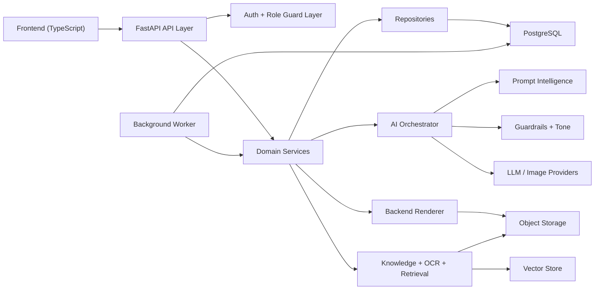
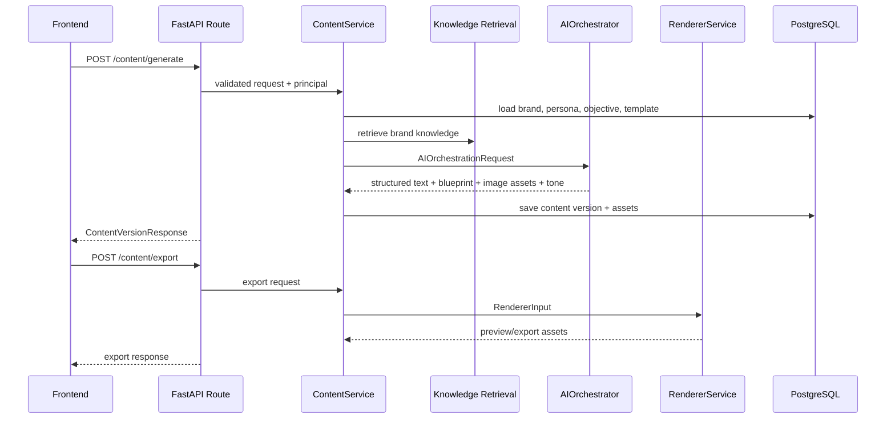

# Architecture

## Purpose

This document recreates the implemented backend architecture for Violyt / BrandLoveStudio.AI based on the current codebase, not a separate conceptual draft.

The system is built as a multi-tenant SaaS backend with:

- FastAPI for API delivery
- PostgreSQL for primary transactional data
- SQLAlchemy async for persistence
- an AI orchestration layer for brand-aware generation
- backend-owned deterministic rendering
- object storage and vector store abstractions
- worker-ready background processing

## High-Level Architecture

## Layered Design

### 1. API Layer

Files:

- `main.py`
- `app/api/router.py`
- `app/api/routes/*.py`

Responsibilities:

- expose versioned REST endpoints under `/api/v1`
- validate request payloads with Pydantic schemas
- authenticate users from bearer tokens
- enforce role and tenant scope before business logic runs
- convert domain exceptions into HTTP responses

### 2. Auth and Access Layer

Files:

- `app/core/dependencies.py`
- `app/core/security.py`
- `app/services/auth.py`

Responsibilities:

- login and activation
- bearer token issue and decode
- current principal resolution
- tenant and Brand Space scope enforcement
- role checks
- explicit block preventing Super Admin from accessing Brand Space content flows

### 3. Domain Service Layer

Files:

- `app/services/*.py`

Responsibilities:

- implement business rules
- keep route handlers thin
- coordinate repositories, AI services, rendering, usage limits, and jobs

Main service modules:

- `TenantService`
- `BrandSpaceService`
- `KnowledgeService`
- `ContentService`
- `ChatService`
- `TemplateService`
- `FolderService`
- `RendererService`
- `ReviewService`
- `SocialService`
- `AnalyticsService`
- `UsageLimitService`
- `JobService`

### 4. Repository Layer

Files:

- `app/repositories/*.py`

Responsibilities:

- encapsulate SQLAlchemy read/write patterns
- centralize scoped access by tenant or Brand Space
- keep query details out of domain services

### 5. AI Orchestration Layer

Files:

- `app/ai/orchestrator.py`
- `app/ai/contracts.py`
- `app/ai/brand_intelligence.py`
- `app/ai/prompt_intelligence.py`
- `app/ai/guardrails.py`
- `app/ai/tone_intelligence.py`
- `app/ai/blueprint.py`
- `app/ai/providers/*`

Responsibilities:

- convert backend context into AI-ready prompts
- apply guardrails before prompt execution
- route requests to the configured providers
- return structured text, blueprint JSON, image assets, tone analysis, and explainability metadata
- resolve conflicts between brand forms, strategy documents, prompt inputs, personas, objectives, and template hints through a deterministic priority policy

The orchestrator is intentionally not the final design renderer. It produces structured output that the backend renderer assembles into final assets.

The orchestration layer now also applies deterministic context-priority handling:

- guardrails and blocked claims override all other inputs
- current Brand Space configuration overrides retrieved documents
- selected persona and objective override generic context
- strategy knowledge outranks campaign history and metadata hints

### 6. Knowledge and RAG Layer

Files:

- `app/services/knowledge.py`
- `app/ai/rag/ocr.py`
- `app/ai/rag/retrieval.py`
- `app/integrations/vector_store.py`

Responsibilities:

- upload and store knowledge assets
- extract text through OCR or document parsing
- index extracted knowledge by tenant, brand, and channel
- retrieve brand-scoped supporting context during generation
- preserve extracted text in PostgreSQL even when vector retrieval is unavailable

### 7. Rendering Layer

Files:

- `app/services/renderer.py`
- `app/ai/contracts.py`

Responsibilities:

- take blueprint zones, structured text, and image assets
- optionally use template assets as a background layer
- assemble final preview and export assets
- enforce deterministic placement and overflow strategy
- keep final layout ownership inside backend
- support multi-page export behavior for carousel, PDF, and infographic-style flows

### 8. Storage and Data Layer

Files:

- `app/db/*`
- `app/models/*`
- `app/integrations/object_storage.py`
- `app/integrations/vector_store.py`

Responsibilities:

- PostgreSQL persistence for transactional records
- local object storage abstraction for uploaded and generated files
- FAISS-backed vector storage abstraction for knowledge retrieval

## Multi-Tenant Isolation Model

The architecture enforces isolation with scoped columns and scoped repository/service access.

Common scope fields:

- `tenant_id`
- `brand_space_id`

Isolation rules:

- tenant-owned entities are filtered by `tenant_id`
- brand-owned entities are filtered by `brand_space_id`
- Brand Users are restricted to assigned Brand Spaces
- external reviewers never use tenant auth and only access tokenized review resources

## Core Functional Domains

### Tenant and Auth

Purpose:

- tenant creation
- user onboarding
- role assignment
- usage-limit management

### Brand Space

Purpose:

- 10-step sectioned brand setup
- versioned brand configuration
- brand lifecycle control
- resolved brand context generation

Brand lifecycle states:

- `draft`
- `active`
- `archived`
- `deleted`

### Knowledge

Purpose:

- brand documents and reference upload
- OCR and text extraction
- vector indexing and reprocessing

Knowledge lifecycle states:

- `uploaded`
- `processing`
- `indexed`
- `failed`
- `deleted`

### Content and Chat Workspace

Purpose:

- prompt-driven content generation
- rewrite and tone checking
- session-backed workspace history
- chat-driven generation flows

Content lifecycle states:

- `generated`
- `edited`
- `organized`
- `shared`
- `archived`

### Templates and Rendering

Purpose:

- upload templates
- store editable field metadata
- apply templates without overriding brand configuration
- recommend matching templates from user prompt + studio panel + template metadata
- render previews and exports inside backend

### Review and Collaboration

Purpose:

- share links
- external comments
- approval or needs-changes status flow

### Social and Analytics

Purpose:

- social connection records
- publish request placeholders
- super-admin platform analytics
- tenant and Brand Space usage metrics

## AI Execution Flow

## Background Processing Flow

Jobs are persisted in PostgreSQL and polled by the worker loop.

Current async job types:

- `knowledge_process`
- `template_analysis`
- `render_preview`
- `render_export`
- `social_publish`

Current worker implementation:

- `app/workers/runner.py`

The architecture is queue-friendly, so the polling loop can later be replaced by Celery, RQ, Dramatiq, or another worker system without changing API contracts.

## Explainability and Safety

Explainability metadata is saved with generated content and currently includes:

- retrieval channels used
- selected persona
- selected objective
- brand context snapshot
- research summary
- provider names
- conversation context

Safety controls:

- guardrails validate prompts before model execution
- brand guardrails are never bypassed by downstream layers
- tone consistency scoring is returned with rewrite suggestions

## Design Decisions Embedded in This Codebase

- final visual layout is rendered in backend, not treated as a raw AI image output
- brand configuration changes only affect future generations
- edits produce new content versions instead of overwriting history
- knowledge deletions remove associated retrieval index entries
- usage limits are enforced before billable or expensive actions proceed
- provider selection is config-driven rather than hardcoded
- storage and vector providers are abstracted for future replacement

## Current Implementation Boundaries

What is implemented cleanly now:

- modular backend and AI service separation
- multi-tenant data model
- session-based chat workspace
- brand-aware generation pipeline
- deterministic backend renderer
- platform-aware studio presets for Instagram, LinkedIn, X, and YouTube thumbnail generation
- prompt-aware template recommendation and template-backed rendering
- encrypted social connector token persistence
- worker-ready job structure
- FAISS-backed knowledge retrieval

What is still intentionally simple:

- social publishing is validated dispatch scaffolding, not a live provider-posting implementation
- template analysis uses OpenAI Vision when configured, but falls back to heuristics when unavailable
- renderer is safe and deterministic, but not a full freeform design editor
- object storage is local by default
- queueing is polling-based by default
