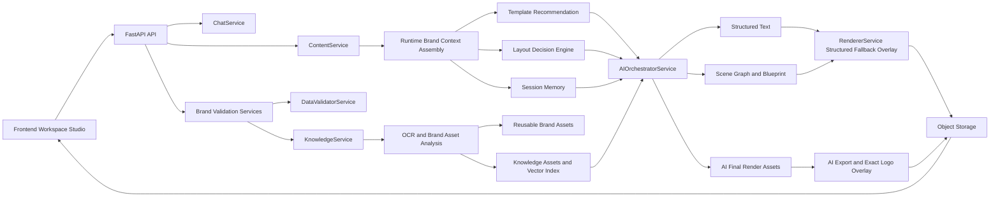
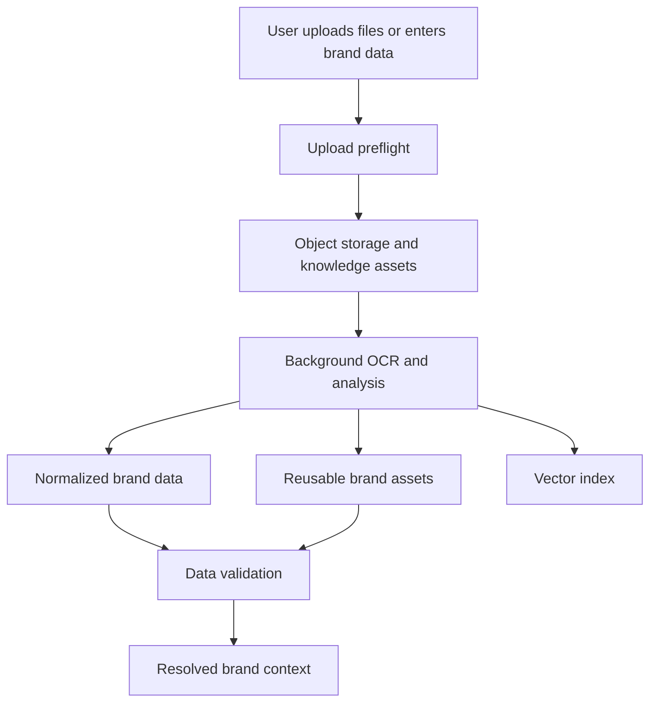
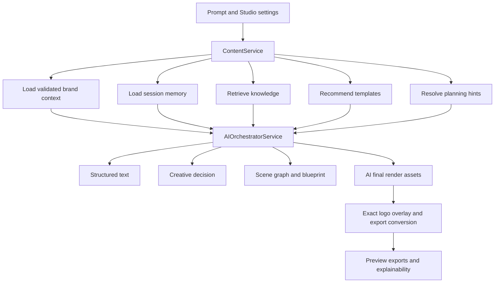
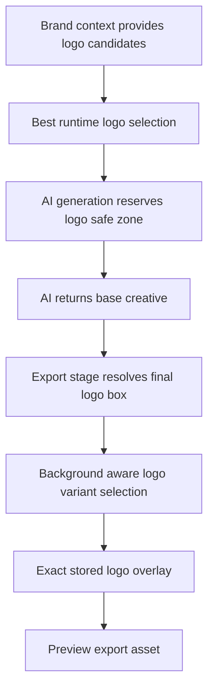

# Creative Generation Architecture

This document describes the current creative-generation architecture in Violyt as it exists today after the recent AI-led rendering, logo-handling, brand-context, and export-path changes.

It is intentionally focused on the creative system rather than the entire product stack.

## What This Architecture Owns

- Brand Space data intake and normalization
- Asset analysis and reusable brand-asset extraction
- Runtime brand-context assembly
- Template recommendation and layout decisioning
- AI-led copy, scene, and image generation
- Exact-logo preservation and export handling
- Structured rendering fallback paths
- Chat and Studio UI touchpoints that shape generation input/output

## Core Design Principles

- AI should own the main creative composition whenever possible.
- Backend should own deterministic finishing, export conversion, and exact brand-asset preservation.
- Brand truth should come from validated Brand Space data, not ad hoc prompt guessing.
- Templates should influence style or structure only when they are actually relevant.
- Logos should be used as exact stored assets, never redrawn or recolored by AI.
- Reference assets should help conditioning only when they are safe and useful.

## High-Level Architecture

## Main Modules

### Frontend

- Workspace chat and Studio controls gather the generation intent, format, platform, output type, and user prompt.
- Brand Space editor captures structured brand data, uploads, and attachment-backed knowledge.
- Share/review screens consume preview and export assets returned by the backend.

### API + Domain Services

- `ChatService` coordinates chat-session message flow.
- `ContentService` is the main runtime orchestrator on the backend side.
- `KnowledgeService` handles upload storage, indexing, and retrieval.
- `DataValidatorService` builds the validated `resolved_brand_context`.
- `TemplateService` recommends templates and exposes metadata.

### AI Layer

- `AIOrchestratorService` creates structured text, creative decisions, scene graphs, and AI render prompts.
- `PromptIntelligenceService`, guardrails, and tone modules refine instructions and safety.
- Provider routing sends text/image/edit requests to the configured model providers.

### Render + Export Layer

- AI-led final renders are preferred for `static`, `story`, `poster`, `carousel`, and `infographic`.
- Backend export logic preserves exact brand assets, especially the logo.
- Structured renderer still exists for deterministic fallback and some overlay/export responsibilities.

### Storage + Persistence

- PostgreSQL stores Brand Space state, templates, content versions, assets, validation snapshots, and job state.
- Object storage stores uploads, derived assets, AI outputs, previews, and exports.
- Vector storage supports retrieval from uploaded knowledge.

## Runtime Flow

### 1. Brand Space Ingestion

What comes out of this stage:

- validated identity data
- logo candidates and logo variants
- palette evidence
- typography evidence
- reusable icons / decorative assets / micro-design assets
- reference creatives and mood boards

### 2. Generation Request Flow

### 3. Output Authority

| Format | Primary visual authority | Notes |
|---|---|---|
| Static | AI-led | Exact stored logo overlaid afterward if needed |
| Story | AI-led | Same logo/export handling as static |
| Poster | AI-led | Same logo/export handling as static |
| Carousel | AI-led multi-slide | Slide assets exported directly; shared logo logic per slide |
| Infographic | AI-led single/tall render | Shared logo/export logic; structured fallback remains available |
| PDF / DOC / JPG export | AI-led source assets converted by backend | Backend converts AI outputs instead of rebuilding the design from scratch |

## Brand Context Assembly

The generation system does not use raw uploads directly. It first assembles a runtime brand context from:

- validated section payloads
- identity/logo records
- reusable brand assets
- reference creatives and mood boards
- palette and typography evidence
- retrieval output from knowledge assets

Runtime context is responsible for:

- palette roles
- typography direction
- logo candidate selection
- reusable icon/decorative assets
- reference asset catalog
- brand-safe prompt hints

## Template Decisioning

Templates are treated in three broad modes:

- exact template
- adapted template
- synthesized layout

Important behavior:

- weak topic-fit templates are downgraded so they do not force literal structure/content into the result
- style-only templates can still influence mood, spacing, or palette direction
- style-only template geometry should not be allowed to dictate final exact-logo placement

## Reference Assets and Visual Conditioning

The system now distinguishes between:

- literal template/reference surfaces
- conditioning-safe reference images
- reusable iconography / micro-design assets
- exact logo assets

Rules:

- exact logos are never used as conditioning images
- weak style-only reference creatives should not crowd out better conditioning-safe assets
- trusted hero/reference creatives can condition AI generation
- trusted reusable icons and enhancement assets should help carousel/infographic outputs feel richer

## Logo Architecture

### Goals

- never let AI recreate the real logo
- preserve exact stored logo colors and proportions
- place the logo in a reserved, non-colliding zone
- choose the correct stored logo variant for the actual background

### Current Flow

### Important Logo Rules

- the AI prompt must keep the logo-safe corner free of text or ghost branding
- the export stage may switch to a different stored logo variant if the real rendered corner background requires it
- the final overlaid logo should be exact, not regenerated
- logo placement should ignore weak synthesized or style-only logo geometry

## Rendering and Export Strategy

There are now two main render paths:

### AI-led path

Used when the system has a valid final AI render asset for the requested format.

Responsibilities:

- preserve AI composition
- apply exact logo if AI did not already do so
- convert outputs to `png`, `jpg`, `pdf`, or `doc`
- keep multi-slide order for carousel

### Structured render / overlay path

Still available when the system needs deterministic composition help or when AI final assets are unavailable.

Responsibilities:

- structured text layout
- deterministic export formatting
- controlled overlays on top of an existing base canvas

## Why Outputs Can Still Drift

Even with the stronger render path, the output can still feel wrong if:

- Brand Space logo variants are incomplete or ambiguous
- palette roles are weak or conflicting
- reference creatives are noisy or off-topic
- hero/icon assets are present but not trusted enough to condition AI
- template relevance is weak but still leaks visual bias

That is why Brand Space data quality and validation remain critical.

## Recommended Next Focus Areas

### 1. Brand Space canonical curation

- explicit primary logo
- explicit light/dark logo variants
- explicit palette role confirmation
- explicit typography role confirmation
- explicit hero/reference asset curation

### 2. Stronger visual asset ranking

- rank trusted people-led hero references higher when the prompt implies expertise or confidence
- keep style-only references from suppressing usable brand assets

### 3. Richer infographic/carousel planning

- better modular section planning
- stronger icon/diagram usage
- stricter anti-text-poster behavior

## Practical Debug Checklist

When a generation looks wrong, inspect these first:

- Was `render_authority` AI or backend?
- Did `selected_reference_images` contain useful conditioning-safe assets?
- Was `reference_conditioned_by_ai` true?
- Which `logo_selection` and `logo_asset_path` were chosen?
- Did the final export metadata show `logo_overlay_strategy = exact_asset_overlay`?
- Was the chosen template actually topic-relevant or only style-relevant?

## Summary

The current architecture is now centered on:

- validated Brand Space truth
- AI-owned visual composition
- backend-owned exact logo preservation and export conversion
- controlled use of templates and reference assets

That is the right long-term split for quality, brand safety, and extensibility.
