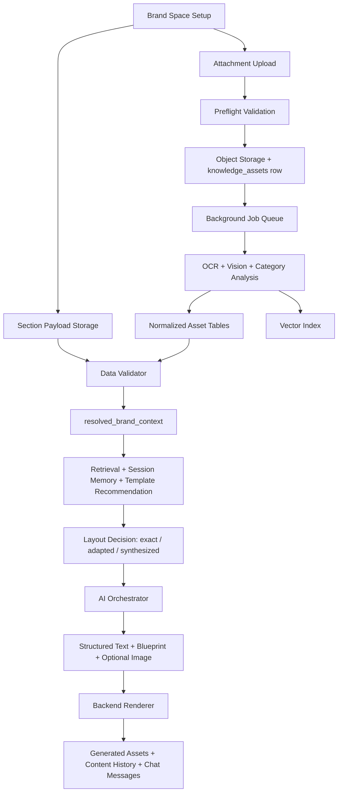

# Violyt Current Architecture State

This document describes how the system works today from Brand Space setup to generation and rendering. It is intended as a developer handoff for the current implementation state, not a target-state product spec.

## Scope

- Multi-tenant Brand Space setup and lifecycle
- Attachment upload, OCR, parsing, normalization, and validation
- Brand context assembly
- Retrieval and generation orchestration
- Template selection and layout decision
- Backend rendering
- Content/session persistence

## High-Level Flow

## End-To-End Runtime Behavior

### 1. Brand Space creation and lifecycle

- Brand Spaces are created first and can exist in `draft` state with partial data.
- Brand section form data is stored in section payloads rather than one giant flat record.
- Generation is allowed only when the Brand Space is `active`.

Primary persistence:

- `brand_spaces`
- `brand_configuration_sections`
- `personas`
- `guardrails`
- `objectives`

Key files:

- `app/models/brand.py`
- `app/services/brand.py`

### 2. Upload and preflight validation

- Files uploaded against Brand Space fields are validated before expensive work starts.
- Current validation includes:
  - allowed extension / MIME type
  - max decoded file size
  - max PDF pages
  - max PPTX slides
  - max image megapixels
- If validation passes, the binary is stored and a `knowledge_assets` record is created.

Current default limits:

- max file size: `25 MB`
- max PDF pages: `120`
- max presentation slides: `80`
- max image size: `36 MP`

Key files:

- `app/services/upload_preflight.py`
- `app/core/config.py`
- `app/integrations/object_storage.py`
- `app/models/knowledge.py`

### 3. Background job processing

- Upload processing is async.
- A job is created for asset ingestion.
- Worker claims the job, performs OCR and category-specific analysis, updates processing status, and writes results back.
- Processing status is separately persisted so frontend can show `uploaded`, `queued`, `processing`, `indexed`, `failed`, etc.

Primary persistence:

- `jobs`
- `asset_processing_status`

Key files:

- `app/services/jobs.py`
- `app/workers/runner.py`
- `app/models/brand_assets.py`

### 4. OCR and category routing

- OCR extracts text and image candidates from uploaded inputs.
- The analyzer then routes the asset into a category based on:
  - explicit field intent
  - explicit requested category
  - heuristics from filename, text, and visual hints
- Current asset categories include:
  - logo
  - audience insight
  - reference creative
  - template
  - mood board
  - color palette
  - typography guide
  - positive word bank
  - negative word bank
  - replaceable word bank
  - knowledge other

Outputs from analysis:

- raw extracted text
- structured JSON
- normalized JSON
- routing metadata
- warnings / confidence
- optional reusable derived assets

Key files:

- `app/ai/rag/ocr.py`
- `ocr_processor.py`
- `app/ai/brand_asset_analysis.py`

### 5. Normalized brand intelligence storage

The original upload always remains in `knowledge_assets`, and normalized data is also written into category-specific tables.

Normalized tables:

- `brand_logo_assets`
- `brand_logo_metadata`
- `audience_insight_assets`
- `audience_insight_structured_data`
- `visual_reference_assets`
- `mood_board_assets`
- `reusable_brand_assets`
- `color_palette_entries`
- `typography_guides`
- `word_bank_uploads`
- `positive_words`
- `negative_words`
- `replaceable_words`
- `asset_validation_results`
- `asset_category_routing`
- `data_conflicts`
- `resolved_brand_context_snapshots`

Key file:

- `app/models/brand_assets.py`

### 6. Template intelligence

- Uploaded templates and some reference creatives can be represented as reusable templates.
- The system stores both a source template record and richer metadata for matching and rendering.

Template persistence:

- `templates`
- `template_metadata`

Template metadata currently includes:

- zone map
- sizing rules
- platform rules
- editable fields
- export rules
- analysis JSON
- matcher features

Key files:

- `app/models/knowledge.py`
- `app/services/template.py`

### 7. Validation and resolved brand context

- Before generation, the validator assembles a usable brand context from:
  - section payloads
  - normalized asset tables
  - template intelligence
  - word banks
  - audience insights
- It also:
  - detects conflicts
  - marks warnings
  - excludes unusable assets
  - stores a validated snapshot
- Generation uses this validated context, not the raw uploaded inputs directly.

Outputs:

- `brand_spaces.resolved_brand_context`
- `resolved_brand_context_snapshots`
- `data_conflicts`
- `asset_validation_results`

Key file:

- `app/services/data_validation.py`

### 8. Retrieval

- Extracted text is chunked and indexed by tenant + brand + channel.
- Retrieval is used during generation to bring in supporting knowledge from uploaded materials.
- Current channels include brand, strategy, metadata, template, audience insights, visual identity, mood board, reference creative, guardrail support, and chat reference.

Storage:

- FAISS namespaces under local vector store

Key file:

- `app/integrations/vector_store.py`

### 9. Session-aware generation

- Generation requests include:
  - prompt
  - session ID
  - persona ID
  - objective ID
  - template ID
  - studio panel settings
  - optional reference assets
- The backend also loads:
  - recent chat history
  - recent generated outputs
  - latest session context
- Follow-up prompts can be interpreted as:
  - modify previous output
  - generate a variant of previous output
  - create something new

Key files:

- `app/services/content.py`
- `app/ai/session_memory.py`

### 10. Template recommendation and layout decision

- The system recommends templates based on:
  - platform fit
  - export fit
  - prompt tokens
  - content patterns
  - template zone roles
  - brand palette / font / logo fit
- The final layout decision is one of:
  - `exact_template`
  - `adapted_template`
  - `synthesized_layout`

Key files:

- `app/services/template.py`
- `app/ai/layout_decision.py`

### 11. AI orchestration

- The AI layer does not directly render the final design.
- It generates:
  - structured text
  - metadata
  - optional supporting image
  - blueprint payload
- Prompt composition includes:
  - validated brand context
  - persona and objective
  - retrieved knowledge
  - session memory
  - reference assets
  - template context
  - layout decision

Key files:

- `app/ai/orchestrator.py`
- `app/ai/prompt_intelligence.py`

### 12. Backend rendering

- Final composition happens in backend.
- Renderer currently applies:
  - resolved output size
  - palette
  - logo
  - template background if used
  - template style hints where available
  - uploaded font files where available
  - generated image asset
  - some reusable decorative assets

Outputs:

- preview image
- export file

Key file:

- `app/services/renderer.py`

### 13. Output persistence

- All generated outputs and their conversation links are stored.

Primary persistence:

- `sessions`
- `chat_messages`
- `content_history`
- `generated_assets`

Key file:

- `app/models/content.py`

## Storage Map

### Postgres

- Brand Space core data:
  - `brand_spaces`
  - `brand_configuration_sections`
  - `personas`
  - `guardrails`
  - `objectives`
- Uploaded asset registry:
  - `knowledge_assets`
- Normalized brand intelligence:
  - tables in `app/models/brand_assets.py`
- Template intelligence:
  - `templates`
  - `template_metadata`
- Validation and conflict tracking:
  - `asset_validation_results`
  - `asset_category_routing`
  - `data_conflicts`
  - `resolved_brand_context_snapshots`
- Chat and generated outputs:
  - `sessions`
  - `chat_messages`
  - `content_history`
  - `generated_assets`

### Object storage

- Raw uploaded binaries
- Derived reusable visual assets
- Generated outputs

Current local structure is tenant/brand/category scoped by object storage.

### Vector store

- FAISS namespaces scoped by tenant + brand + channel
- Holds searchable extracted chunks for retrieval

## Current Field Matrix

Quality levels:

- `High`: materially implemented and reliably used
- `Medium`: implemented but still heuristic or partial
- `Low`: stored or inferred, but not strongly driving final render yet

| Field | Extracted today | Stored where | Used in generation? | Used in renderer? | Quality |
|---|---|---|---|---|---|
| Brand identity text fields | brand name, description, industry, basic identity data from form sections | `brand_configuration_sections.payload`, `brand_spaces` | Yes | Indirectly | High |
| Foundations | mission, value, positioning-style fields from form sections | `brand_configuration_sections.payload` | Yes | No direct visual use | High |
| Voice & tone | tone attributes, emotion, writing preferences | `brand_configuration_sections.payload` | Yes | Indirect only | High |
| Personas | demographics, psychographics, motivations, pain points, behavior | `personas` | Yes | No direct visual use | High |
| Objectives | content goal, platform scope, config | `objectives` | Yes | Indirectly | High |
| Logos | multiple logos, colors, compatibility, size rules, tagline, font hints | `knowledge_assets`, `brand_logo_assets`, `brand_logo_metadata` | Yes | Yes | High |
| Audience insights | segments, behaviors, motivations, pain points, preferences, demographics, psychographics, research summary | `knowledge_assets`, `audience_insight_assets`, `audience_insight_structured_data` | Yes | No direct visual use | High |
| Color palette | primary/secondary/accent-like entries, hex/rgb, role map, dominant colors | `knowledge_assets`, `color_palette_entries` | Yes | Yes | High |
| Typography guide | font families, style hierarchy, usage patterns | `knowledge_assets`, `typography_guides` | Yes | Yes, partly | Medium |
| Uploaded font files | `.ttf/.otf` files and metadata | `knowledge_assets`, `typography_guides`, resolved context font asset paths | Yes | Yes, preferred where available | Medium |
| Reference creatives / templates: structure | layout type, reusable zones, CTA area, platform hints, section patterns | `templates`, `template_metadata`, `visual_reference_assets`, `knowledge_assets` | Yes | Yes | High |
| Reference creatives / templates: text structure | heading, header, footer, text-style map, size hints | `templates.analysis_json`, `template_metadata`, `visual_reference_assets` | Yes | Yes, partly | Medium |
| Reference creatives / templates: colors | dominant colors, color usage, palette hints | `templates.analysis_json`, `visual_reference_assets`, `color_palette_entries` | Yes | Yes | Medium |
| Reference creatives / templates: font colors | per-text color hints from OCR/analysis sidecar | `templates.analysis_json` / style maps | Yes | Yes, partly | Medium |
| Reference creatives / templates: gradients | inferred gradient specs and gradient hints | `templates.analysis_json` | Yes | Yes, partly | Medium |
| Mood boards | style summary, icon assets, micro elements, decorative assets, enhancement components | `knowledge_assets`, `mood_board_assets` | Yes | Limited direct use | Medium |
| Reusable extracted micro-assets | cropped/derived icons, logo variants, decorative assets, sub-images | `reusable_brand_assets` | Yes | Yes, limited decorative placement | Medium |
| Positive word bank | approved words/phrases | `word_bank_uploads`, `positive_words`, validated guardrails context | Yes | No | High |
| Negative word bank | blocked/avoid words | `word_bank_uploads`, `negative_words`, validated guardrails context | Yes | No | High |
| Replaceable words | discouraged terms plus replacements | `word_bank_uploads`, `replaceable_words`, validated guardrails context | Yes | No | High |
| Brand knowledge other | generic OCR text, heuristic routing, extracted summaries, classified content | `knowledge_assets`, sometimes routed normalized tables | Yes | Usually no direct use | Medium |
| Template selection metadata | score, match type, adaptation plan, platform fit, content-pattern fit, brand fit | `templates.matcher_features_json`, generation explainability metadata | Yes | Yes, through blueprint and render mode | High |
| Validation warnings / conflicts | warnings, exclusions, conflicts, clean snapshot | `asset_validation_results`, `data_conflicts`, `resolved_brand_context_snapshots`, `brand_spaces.resolved_brand_context` | Yes | Yes, indirectly by excluding bad data | High |
| Session history / previous generated outputs | recent prompts, messages, previous content versions, layout decisions | `sessions`, `chat_messages`, `content_history` | Yes | Indirectly | High |

## Current Practical Limits

- The system is strong on structured extraction, normalized storage, validation, and deterministic rendering.
- It is not yet a universal 1:1 creative reconstruction engine for arbitrary uploaded references.
- Typography and template-style fidelity are much stronger than earlier, but still partly heuristic.
- Reusable icons and decorative elements are now extracted and stored, but placement logic is still lighter than a full design recreation engine.

## One-Line Summary

Current behavior is:

`Brand Space + uploaded assets -> OCR / vision / routing -> normalized intelligence -> validation -> retrieval + session memory + template scoring -> AI structured output + blueprint -> backend renderer -> stored outputs and history`
