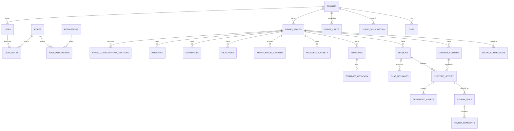

# Database Schema

## Purpose

This document describes the implemented PostgreSQL schema for the Violyt backend.

Source of truth in code:

- `app/models/*.py`
- `app/models/mixins.py`
- `alembic/versions/0001_initial_schema.py`

Important note:

- the current initial Alembic revision delegates schema creation to SQLAlchemy metadata via `Base.metadata.create_all(...)`
- any future schema changes should ideally be added as explicit Alembic revisions

## Shared Column Mixins

Several tables inherit common columns from `app/models/mixins.py`.

### `UUIDPrimaryKeyMixin`

- `id UUID PRIMARY KEY`

### `TimestampMixin`

- `created_at TIMESTAMPTZ NOT NULL DEFAULT now()`
- `updated_at TIMESTAMPTZ NOT NULL DEFAULT now()`

### `SoftDeleteMixin`

- `deleted_at TIMESTAMPTZ NULL`

### `TenantScopedMixin`

- `tenant_id UUID NOT NULL REFERENCES tenants(id) ON DELETE CASCADE`

### `BrandScopedMixin`

- `brand_space_id UUID NULL REFERENCES brand_spaces(id) ON DELETE CASCADE`

## Schema Domains

The schema is grouped into these domains:

- tenant and access control
- Brand Space configuration
- knowledge and templates
- content and chat
- collaboration and review
- analytics, usage, and jobs

## Entity Relationship Overview

## Tables

## 1. Tenant and Access Control

### `tenants`

Purpose:

- root business account for multi-tenant isolation

Columns:

- `id`
- `name`
- `slug` unique
- `contact_email` unique
- `contact_number`
- `address`
- `logo_asset_path`
- `is_active`
- `metadata_json`
- `created_at`
- `updated_at`

### `users`

Purpose:

- authenticated users, tenant admins, tenant users, brand users

Columns:

- `id`
- `tenant_id` nullable for super admins
- `email` unique
- `full_name`
- `phone_number`
- `hashed_password`
- `is_active`
- `is_activated`
- `last_login_at`
- `created_at`
- `updated_at`

### `roles`

Purpose:

- named role catalog

Columns:

- `id`
- `code` unique
- `name`
- `description`
- `created_at`
- `updated_at`

Seeded default role codes:

- `super_admin`
- `tenant_admin`
- `tenant_user`
- `brand_user`
- `external_reviewer`

### `permissions`

Purpose:

- permission catalog

Columns:

- `id`
- `code` unique
- `name`
- `description`
- `created_at`
- `updated_at`

### `role_permissions`

Purpose:

- role-to-permission mapping

Columns:

- `id`
- `role_id`
- `permission_id`
- `created_at`
- `updated_at`

Constraints:

- unique on `role_id, permission_id`

### `user_roles`

Purpose:

- user role assignments, optionally scoped to a Brand Space

Columns:

- `id`
- `user_id`
- `role_id`
- `brand_space_id` nullable
- `created_at`
- `updated_at`

Constraints:

- unique on `user_id, role_id, brand_space_id`

### `activation_tokens`

Purpose:

- first-time user activation and password setup

Columns:

- `id`
- `user_id`
- `token` unique
- `expires_at`
- `used_at`
- `created_at`
- `updated_at`

## 2. Brand Space Configuration

### `brand_spaces`

Purpose:

- root container for brand-specific setup, generation, templates, content, and collaboration

Columns:

- `id`
- `tenant_id`
- `name`
- `slug`
- `description`
- `industry_category`
- `sub_industry`
- `geography_country`
- `geography_city`
- `audience_type`
- `lifecycle_state`
- `is_finalized`
- `overview_snapshot JSONB`
- `resolved_brand_context JSONB`
- `default_persona_id`
- `deleted_at`
- `created_at`
- `updated_at`

Lifecycle values:

- `draft`
- `active`
- `archived`
- `deleted`

### `brand_configuration_sections`

Purpose:

- versioned storage for Brand Space setup sections

Columns:

- `id`
- `tenant_id`
- `brand_space_id`
- `section_code`
- `version`
- `is_current`
- `completion_percent`
- `payload JSONB`
- `created_at`
- `updated_at`

Constraints:

- unique on `brand_space_id, section_code, version`

Main section codes:

- `identity`
- `foundations`
- `voice_tone`
- `personas`
- `guardrails`
- `knowledge`
- `prompt_intelligence`
- `objectives`
- `visual_identity`
- `review`

### `personas`

Purpose:

- brand personas and default persona selection

Columns:

- `id`
- `tenant_id`
- `brand_space_id`
- `name`
- `role`
- `psychographics JSONB`
- `demographics JSONB`
- `audience_goals JSONB`
- `motivations JSONB`
- `fears_and_pain_points JSONB`
- `objections JSONB`
- `content_behavior JSONB`
- `language_preference`
- `is_default`
- `created_at`
- `updated_at`

### `guardrails`

Purpose:

- brand-level prompt and output rules

Columns:

- `id`
- `tenant_id`
- `brand_space_id`
- `positive_word_bank JSONB`
- `replaceable_words JSONB`
- `negative_word_bank JSONB`
- `dos JSONB`
- `donts JSONB`
- `forbidden_prompt_patterns JSONB`
- `restricted_topics JSONB`
- `restricted_claims JSONB`
- `blocked_words JSONB`
- `custom_rules JSONB`
- `created_at`
- `updated_at`

### `objectives`

Purpose:

- campaign and output goals used during generation

Columns:

- `id`
- `tenant_id`
- `brand_space_id`
- `name`
- `description`
- `content_type`
- `platform_scope`
- `is_default`
- `configuration JSONB`
- `created_at`
- `updated_at`

### `brand_space_members`

Purpose:

- explicit user membership for Brand Space access

Columns:

- `id`
- `tenant_id`
- `brand_space_id`
- `user_id`
- `can_manage`
- `created_at`
- `updated_at`

Constraints:

- unique on `brand_space_id, user_id`

## 3. Knowledge and Templates

### `knowledge_assets`

Purpose:

- uploaded brand documents and extracted knowledge state

Columns:

- `id`
- `tenant_id`
- `brand_space_id`
- `name`
- `original_filename`
- `mime_type`
- `storage_path`
- `lifecycle_state`
- `channel`
- `page_count`
- `metadata_json JSONB`
- `extracted_text`
- `extracted_summary`
- `processing_error`
- `last_indexed_at`
- `deleted_at`
- `created_at`
- `updated_at`

Lifecycle values:

- `uploaded`
- `processing`
- `indexed`
- `failed`
- `deleted`

Channel examples:

- `brand`
- `strategy`
- `metadata`
- `template`
- `campaign_history`

### `templates`

Purpose:

- uploaded template assets used during backend rendering

Columns:

- `id`
- `tenant_id`
- `brand_space_id`
- `name`
- `description`
- `kind`
- `storage_path`
- `is_active`
- `analysis_json JSONB`
- `tags JSONB`
- `created_at`
- `updated_at`

Kinds:

- `prompt_framework`
- `layout`
- `hybrid`

### `template_metadata`

Purpose:

- editable template rules and layout-aware metadata

Columns:

- `id`
- `tenant_id`
- `brand_space_id`
- `template_id`
- `zone_map JSONB`
- `sizing_rules JSONB`
- `platform_rules JSONB`
- `editable_fields JSONB`
- `export_rules JSONB`
- `created_at`
- `updated_at`

## 4. Content and Chat Workspace

### `sessions`

Purpose:

- Brand workspace and chat sessions

Columns:

- `id`
- `tenant_id`
- `brand_space_id`
- `user_id`
- `title`
- `session_kind`
- `studio_panel JSONB`
- `conversational_context JSONB`
- `is_active`
- `created_at`
- `updated_at`

Current `session_kind` usage:

- `chat`
- general content workspace sessions created by content flows

### `chat_messages`

Purpose:

- persisted message history for chat sessions

Columns:

- `id`
- `tenant_id`
- `brand_space_id`
- `session_id`
- `user_id` nullable
- `content_version_id` nullable
- `role`
- `message_text`
- `structured_payload JSONB`
- `citations JSONB`
- `created_at`
- `updated_at`

### `content_folders`

Purpose:

- organization buckets for content history

Columns:

- `id`
- `tenant_id`
- `brand_space_id`
- `name`
- `description`
- `created_by`
- `created_at`
- `updated_at`

Constraints:

- unique on `brand_space_id, name`

### `content_history`

Purpose:

- immutable content version history

Columns:

- `id`
- `tenant_id`
- `brand_space_id`
- `session_id`
- `folder_id` nullable
- `parent_version_id` nullable
- `created_by`
- `lifecycle_state`
- `content_type`
- `title`
- `prompt`
- `selected_persona_id` nullable
- `selected_template_id` nullable
- `objective_id` nullable
- `studio_panel JSONB`
- `generated_payload JSONB`
- `blueprint_payload JSONB`
- `explainability_metadata JSONB`
- `tone_score` nullable
- `tone_feedback JSONB`
- `deleted_at`
- `created_at`
- `updated_at`

Lifecycle values:

- `generated`
- `edited`
- `organized`
- `shared`
- `archived`

### `generated_assets`

Purpose:

- assets created through image generation or backend rendering

Columns:

- `id`
- `tenant_id`
- `brand_space_id`
- `content_version_id` nullable
- `template_id` nullable
- `asset_role`
- `mime_type`
- `storage_path`
- `width`
- `height`
- `metadata_json JSONB`
- `deleted_at`
- `created_at`
- `updated_at`

Asset role examples:

- `logo`
- `ai_image`
- `template_preview`
- `render_preview`
- `render_export`
- `knowledge_upload`
- `reference_creative`
- `generated_document`

## 5. Collaboration, Analytics, and Reliability

### `review_links`

Purpose:

- external share links for review and approval

Columns:

- `id`
- `tenant_id`
- `brand_space_id`
- `content_version_id`
- `created_by`
- `token` unique
- `title`
- `status`
- `allow_external_comments`
- `expires_at`
- `created_at`
- `updated_at`

Status values:

- `pending`
- `approved`
- `needs_changes`

### `review_comments`

Purpose:

- user or external comments tied to a review link

Columns:

- `id`
- `tenant_id`
- `brand_space_id`
- `review_link_id`
- `author_user_id` nullable
- `external_author_name` nullable
- `body`
- `metadata_json JSONB`
- `created_at`
- `updated_at`

### `social_connections`

Purpose:

- stored social connection metadata per Brand Space and platform

Columns:

- `id`
- `tenant_id`
- `brand_space_id`
- `platform`
- `account_name`
- `account_identifier`
- `access_token_encrypted`
- `refresh_token_encrypted`
- `scopes JSONB`
- `is_connected`
- `created_at`
- `updated_at`

Constraints:

- unique on `brand_space_id, platform`

### `analytics`

Purpose:

- persisted metric snapshots

Columns:

- `id`
- `tenant_id`
- `brand_space_id`
- `metric_scope`
- `metric_code`
- `metric_value`
- `dimensions JSONB`
- `created_at`
- `updated_at`

### `usage_limits`

Purpose:

- tenant-level plan and allowance record

Columns:

- `id`
- `tenant_id`
- `max_users`
- `max_brand_spaces`
- `max_content_generations`
- `max_image_generations`
- `max_ocr_pages`
- `created_at`
- `updated_at`

### `usage_consumption`

Purpose:

- tracked usage by tenant, metric, and period

Columns:

- `id`
- `tenant_id`
- `metric_code`
- `period_key`
- `consumed`
- `metadata_json JSONB`
- `created_at`
- `updated_at`

Constraints:

- unique on `tenant_id, metric_code, period_key`

Tracked metric codes:

- `users`
- `brand_spaces`
- `content_generations`
- `image_generations`
- `ocr_pages`

### `jobs`

Purpose:

- background job queue state

Columns:

- `id`
- `tenant_id`
- `brand_space_id`
- `content_version_id` nullable
- `knowledge_asset_id` nullable
- `job_type`
- `status`
- `payload JSONB`
- `result_payload JSONB`
- `error_message`
- `retry_count`
- `max_retries`
- `created_at`
- `updated_at`

Job statuses:

- `queued`
- `processing`
- `succeeded`
- `failed`
- `cancelled`

Job types:

- `knowledge_process`
- `template_analysis`
- `render_preview`
- `render_export`
- `social_publish`

## Multi-Tenant Rules Reflected in Schema

- almost every business table includes `tenant_id`
- brand-owned tables also include `brand_space_id`
- all scope FKs cascade on delete
- user roles can be global-to-tenant or scoped to a Brand Space
- historical content is versioned in `content_history` rather than updated in place

## Lifecycle and History Rules Reflected in Schema

- Brand Space lifecycle is stored on `brand_spaces.lifecycle_state`
- knowledge lifecycle is stored on `knowledge_assets.lifecycle_state`
- content lifecycle is stored on `content_history.lifecycle_state`
- soft-delete fields are used where records must be retained for audit or history
- new content versions can reference `parent_version_id`
- current brand configuration is tracked with `brand_configuration_sections.is_current`

## Indexes and Uniqueness You Should Be Aware Of

Key uniqueness rules:

- `tenants.slug`
- `tenants.contact_email`
- `users.email`
- `roles.code`
- `permissions.code`
- `activation_tokens.token`
- `user_roles(user_id, role_id, brand_space_id)`
- `brand_configuration_sections(brand_space_id, section_code, version)`
- `brand_space_members(brand_space_id, user_id)`
- `content_folders(brand_space_id, name)`
- `review_links.token`
- `social_connections(brand_space_id, platform)`
- `usage_consumption(tenant_id, metric_code, period_key)`

## Non-DB Data Stores

These are part of the system but not represented as PostgreSQL tables:

- uploaded files and generated exports in object storage
- vector embeddings and FAISS indexes in the vector store path

The database stores references to those assets by `storage_path` and related metadata.
