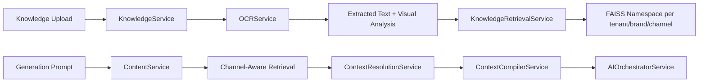
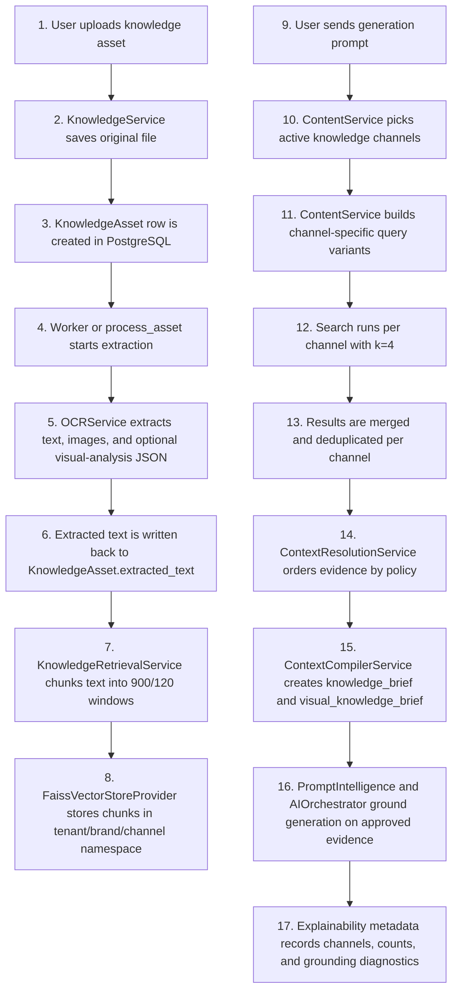

# RAG and Grounding Strategy

## Purpose

This document explains how Violyt uses retrieval-augmented generation (RAG) and grounding today, why the system is designed this way, and how the implementation reduces generic model behavior during brand-aware content generation.

This write-up is based on the current repository implementation, especially:

- `app/services/knowledge.py`
- `app/ai/rag/ocr.py`
- `app/ai/rag/retrieval.py`
- `app/integrations/vector_store.py`
- `app/services/content.py`
- `app/ai/context_resolution.py`
- `app/ai/context_compiler.py`
- `app/ai/prompt_intelligence.py`
- `app/ai/orchestrator.py`

## What RAG Means in This Codebase

In Violyt, RAG is not a single generic "search the vector store and stuff the top chunks into a prompt" step.

The system uses RAG as a controlled context assembly pipeline that:

- ingests uploaded knowledge assets into brand-scoped indices
- retrieves by semantic similarity inside specific knowledge channels
- merges retrieved evidence with saved brand configuration
- applies a deterministic priority policy before prompt generation
- creates a separate visual-grounding brief for image and layout generation
- records retrieval usage in explainability metadata

So, RAG here is part retrieval system, part policy layer, and part grounding guardrail.

## Why the System Uses RAG

The repository is solving a brand-sensitive generation problem, not a generic chatbot problem. That is why retrieval is used.

RAG is used here to:

- keep generation aligned to tenant and Brand Space knowledge instead of relying only on model priors
- let uploaded documents, campaign material, strategy files, mood boards, and reference creatives influence output without hardcoding all of that into the database schema
- support changing brand knowledge over time without retraining a model
- reduce hallucinated messaging, visual direction, and positioning claims
- preserve explainability by showing which knowledge channels were active and how many matches were used
- maintain tenant and Brand Space isolation by searching only within scoped namespaces

Without RAG, the system would depend too heavily on the prompt plus the model's general world knowledge, which is too weak and too generic for brand-safe creative generation.

## High-Level Flow

## How RAG Works End to End

The repository uses a multi-step RAG flow rather than a single retrieval call.

## What the System Stores

RAG in this repository stores data across three different layers, each with a different purpose.

### 1. Original asset storage

`LocalObjectStorage` stores the uploaded source file itself under a tenant and Brand Space path shaped like:

- `tenant_id/brand_space_id/category/generated-file-name`

This is the raw source used for OCR, reprocessing, auditability, and deletion.

### 2. PostgreSQL knowledge metadata

The `knowledge_assets` table stores the durable operational record for each uploaded item.

Important stored fields include:

- identity and scope: `id`, `tenant_id`, `brand_space_id`
- source file details: `name`, `original_filename`, `mime_type`, `storage_path`
- processing state: `lifecycle_state`, `processing_error`, `last_indexed_at`, `page_count`
- knowledge routing: `channel`, `field_key`, `asset_category`, `source_intent`
- extracted payloads: `extracted_text`, `extracted_summary`
- structured enrichment: `metadata_json`, `structured_data_json`, `normalized_data_json`
- validation fields: `validation_state`, `validation_summary_json`

Why this layer exists:

- it tracks asset lifecycle and retry behavior
- it preserves extracted text even if FAISS is unavailable
- it supports scoped listing, deletion, and reprocessing
- it lets downstream services inspect the asset without touching the vector index

### 3. FAISS retrieval data

The vector layer stores chunked documents per namespace in:

- `tenant_id/brand_space_id/channel`

Each stored chunk contains:

- chunk text as `content`
- chunk metadata such as `chunk_id`, `source_id`, `channel`, `document_type`, and asset metadata like filename

The vector provider also keeps a JSON sidecar of stored documents in addition to the FAISS index files so it can:

- rebuild indices
- delete all chunks for a single source asset
- upsert by `chunk_id`

## What the System Retrieves

The repository does not retrieve full assets or raw files during generation. It retrieves scoped chunk-level evidence.

Each retrieval result coming back from `KnowledgeRetrievalService.search()` contains:

- `content`: the retrieved chunk text
- `score`: FAISS similarity score
- `metadata`: chunk metadata including source and channel fields

At generation time, `ContentService` collects retrieval into a dictionary keyed by channel. The system therefore retrieves:

- message and positioning chunks from `strategy`
- brand identity and rules from `brand`
- audience cues from `audience_insights`
- approved language constraints from `guardrail_support`
- visual cues from `visual_identity`, `reference_creative`, and `mood_board`
- supplemental structural hints from `template` and `metadata`
- historical examples from `campaign_history`
- conversational carryover from `chat_reference`

What the model actually consumes is not the raw retrieval response shape. It consumes compiled forms built from those results:

- `knowledge_brief` for general message grounding
- `visual_knowledge_brief` for gated visual grounding
- `context_resolution` metadata describing priority and policy

So the system retrieves chunks, then transforms them into controlled grounding inputs.

## Ingestion and Indexing

Knowledge ingestion is handled by `KnowledgeService`.

Implementation details:

- Uploads are stored first through `LocalObjectStorage`.
- Knowledge assets are persisted in PostgreSQL with lifecycle states such as `uploaded`, `processing`, `indexed`, and `failed`.
- `OCRService` extracts text from PDFs, images, PPTX files, and DOCX-associated images.
- For image inputs, the pipeline can append visual-analysis JSON output into the extracted text stream so that non-text visual signals can still become searchable.
- Extracted text is stored back on the `KnowledgeAsset` record as `extracted_text` and `extracted_summary`, so the system preserves usable knowledge even if retrieval is unavailable later.

`KnowledgeRetrievalService.index_asset()` then splits text with:

- chunk size: `900`
- chunk overlap: `120`

Each chunk is stored with metadata such as:

- `chunk_id`
- `source_id`
- `channel`
- `document_type`
- asset-level metadata such as filename

This metadata is important because later deletion, de-duplication, and explainability all depend on it.

## Vector Storage Model

Vector storage is implemented by `FaissVectorStoreProvider`.

Key design choices:

- Storage backend: FAISS
- Namespace shape: `tenant_id/brand_space_id/channel`
- Embeddings: `OpenAIEmbeddings` when an OpenAI API key is configured
- Fallback embeddings: deterministic `HashEmbeddings` when OpenAI embeddings are unavailable

Why this matters:

- tenant and Brand Space content stay isolated by namespace
- knowledge channels remain separated, so strategy files do not compete directly with template hints or campaign-history snippets
- the system still works in degraded local environments because retrieval can fall back to hash-based embeddings instead of failing completely

The hash fallback is weaker semantically than OpenAI embeddings, but it preserves developer operability and allows the rest of the pipeline to continue functioning.

## Retrieval Is Channel-Aware, Not Flat

During generation, `ContentService._build_retrieved_knowledge()` does not run one retrieval query over one global index.

Instead, it:

1. decides which channels are relevant for the current studio panel
2. builds multiple query variants per channel
3. searches each channel separately with `k=4`
4. merges and de-duplicates results per channel
5. records per-channel state such as indexed assets, processing assets, and match counts

The query step is also not prompt-only. For several channels, `ContentService._knowledge_queries_for_channel()` expands the user prompt with channel-specific descriptors, for example:

- strategy-oriented query expansions for `strategy`
- audience and pain-point expansions for `audience_insights`
- guardrail language expansions for `guardrail_support`
- palette, typography, composition, and visual-system expansions for `visual_identity`
- layout and reusable-zone expansions for `template`

This helps retrieval ask better semantic questions of each channel instead of treating all knowledge the same way.

The active knowledge channels include:

- `brand`
- `strategy`
- `metadata`
- `campaign_history`
- `template`
- `audience_insights`
- `guardrail_support`
- `visual_identity`
- `reference_creative`
- `mood_board`
- `chat_reference`

This is important because each channel serves a different job:

- `strategy` helps message direction and positioning
- `brand` helps identity consistency
- `guardrail_support` helps brand-safe language
- `audience_insights` helps relevance and persuasion
- `visual_identity`, `reference_creative`, and `mood_board` help visual grounding
- `template` and `metadata` act as supplemental structure and design hints

## Why Retrieval Is Separated by Channel

This separation exists because all retrieved evidence should not be treated as equally authoritative.

If all chunks were mixed into one pool:

- template OCR could overpower stronger brand rules
- campaign-history language could override current strategy
- decorative visual references could be mistaken for brand foundations
- low-signal metadata could pollute core message generation

The repository prevents that by retrieving into channels first and resolving conflicts later.

## Context Resolution Policy

After retrieval, Violyt does not pass raw search output directly to the LLM.

`ContextResolutionService` applies an explicit priority policy. The current instruction in code is:

- guardrails first
- current brand form/config sections next
- selected persona and objective next
- strategy knowledge next
- brand knowledge next
- campaign history next
- template and metadata hints next
- user prompt last

This policy exists because the system is brand-led, not retrieval-led.

That means:

- retrieved knowledge can enrich generation
- retrieved knowledge cannot overrule saved brand rules
- lower-priority evidence cannot undo higher-priority brand constraints

This is one of the most important grounding decisions in the repository.

## Retrieval Output Shape Inside Generation

Inside the generation path, retrieved knowledge is assembled as:

- `retrieved_knowledge[channel] -> list[dict]`

Each channel list is:

- sourced only from the matching tenant and Brand Space namespace
- limited after merge and de-duplication
- counted into channel-state telemetry such as `assets_present`, `indexed_assets`, `processing_assets`, `match_count`, and `query_count`

This is why the system can tell the difference between:

- no knowledge exists for a channel
- knowledge exists but has not finished indexing
- knowledge exists and retrieval found usable evidence

That distinction is useful both operationally and for explainability.

## Compiled Context: General Knowledge vs Visual Knowledge

`ContextCompilerService.compile()` creates two different retrieval-derived outputs:

- `knowledge_brief`
- `visual_knowledge_brief`

### `knowledge_brief`

This is the general text grounding layer used for messaging, positioning, and supporting context.

It summarizes top ranked entries from ordered knowledge channels and gives the orchestrator concise, normalized retrieval context.

### `visual_knowledge_brief`

This is a stricter layer used for image and visual direction grounding.

It is not just "top visual chunks." It is a gated evidence pack that:

- ranks visual candidates by channel
- checks whether candidates are allowed for visual grounding
- rejects low-signal or low-quality evidence
- can suppress template-derived cues when stronger visual evidence exists
- can switch between `brand_knowledge` grounding and `llm_fallback`

This separation exists because visual generation is especially vulnerable to drift. A model can easily invent scenes, styles, or compositions that sound aligned in text but are visually off-brand. The dedicated visual brief reduces that risk.

## Grounding Strategy for Visual Generation

The visual grounding strategy is one of the strongest architectural decisions in the repo.

The prompt system and orchestrator explicitly enforce the following ideas:

- if `visual_knowledge_brief.grounding_mode` is `brand_knowledge`, retrieved brand-knowledge items are the primary source of visual grounding
- model reasoning may synthesize or clarify retrieved cues, but must not override them
- if the grounding mode is `llm_fallback`, the system must derive visual direction from approved brand visual brief, message strategy, and other approved fallback sources
- suppressed template cues and rejected candidates must not be reintroduced through model improvisation
- clean OCR or template text is not considered valid primary visual grounding just because it is readable

In other words, the system distinguishes between:

- evidence that is strong enough to ground the visual
- evidence that may help as a secondary hint
- evidence that should be excluded

That is more mature than a basic RAG pipeline and is central to why this architecture is safer for branded creative work.

## Why the Repository Uses a Grounding Gate

The grounding gate exists because not all retrieved assets are equally trustworthy for visual generation.

Examples of bad grounding sources:

- OCR text extracted from a template that contains layout copy but not true brand visual direction
- promotional text that looks polished but is only sample copy
- weak metadata that resembles a style note but is not approved brand guidance
- noisy or low-signal extraction results

If those were allowed to drive image generation directly, the system would produce plausible but unreliable visuals.

So the code uses gating to answer a harder question than "what is similar?":

"What is similar and also safe to treat as real brand-grounding evidence?"

That is the main reason the repository separates retrieval from grounding.

## Explainability and Auditability

The orchestrator persists grounding and retrieval details into `explainability` metadata.

The saved fields include:

- `retrieval_channels`
- `retrieval_match_counts`
- `context_resolution`
- `compiled_context`
- `visual_grounding`
- `selected_persona`
- `selected_objective`
- `brand_context_snapshot`
- `message_strategy`
- provider metadata and token estimates

This is useful because downstream services and reviewers can inspect:

- what channels influenced the generation
- whether the system used direct brand knowledge or fallback grounding
- how much retrieval evidence was actually present
- what policy and context state were active during generation

This is a meaningful architecture advantage over opaque prompt pipelines.

## Why Grounding Matters More Than Basic Retrieval in Violyt

For this product, correct grounding is more important than retrieval volume.

The system is generating brand-facing outputs where failure is not just factual inaccuracy. Failure can also mean:

- off-brand tone
- wrong visual system
- conflict with saved brand guardrails
- template overfitting
- generic stock-style scenes that ignore strategy
- hallucinated claims or misplaced emphasis

That is why the architecture prefers:

- scoped retrieval
- deterministic conflict resolution
- guarded visual grounding
- explainability capture

instead of a larger but less controlled context window.

## Current Strengths

- strong tenant and Brand Space isolation in vector namespaces
- retrieval is explicitly channel-aware
- retrieval and brand configuration are separated, then resolved through policy
- visual grounding is treated as a different problem from text retrieval
- fallback behavior is designed, not accidental
- explainability captures grounding decisions for later inspection
- extracted text is preserved in PostgreSQL even if vector retrieval is unavailable

## Current Boundaries

- retrieval uses FAISS and local file persistence, which is practical but not yet a managed distributed retrieval layer
- the fallback `HashEmbeddings` path preserves operability, but semantic quality is lower than OpenAI embeddings
- there is no dedicated re-ranker or cross-encoder stage yet
- retrieval is limited to relatively small per-channel result sets
- the quality of grounding still depends on OCR quality, source curation, and metadata discipline

## Summary

Violyt uses RAG because brand generation needs live, tenant-scoped knowledge at runtime. It uses grounding because retrieval alone is not enough: the system must decide which retrieved evidence is authoritative, which evidence is only supplemental, and which evidence should be excluded.

That is why the current architecture uses:

- channel-scoped indexing
- channel-aware retrieval
- deterministic context resolution
- separate visual grounding diagnostics and gating
- explainability metadata for auditability

This combination is what makes the implementation more reliable than a prompt-only or generic RAG design for brand-safe creative generation.
