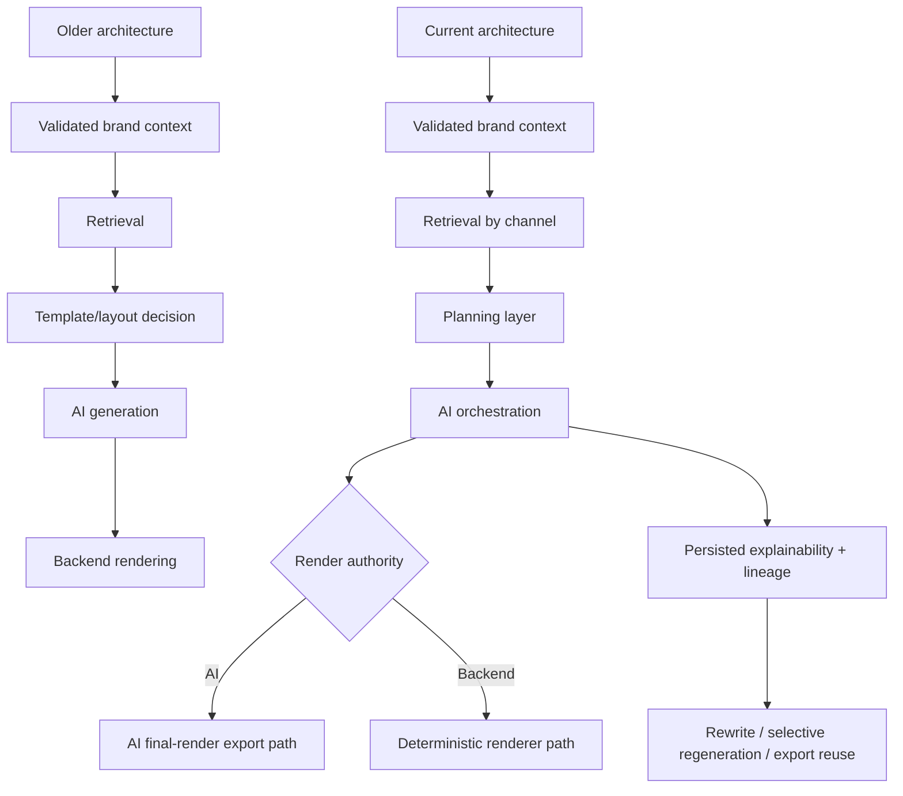

# Old vs Current Architecture Comparison

## Purpose

This document compares the older architecture writeups in:

- `docs/CURRENT_ARCHITECTURE_STATE.md`
- `docs/CREATIVE_GENERATION_ARCHITECTURE.md`
- `docs/RAG_GROUNDING_STRATEGY.md`

against the current implementation in the repository.

It is meant to answer two questions:

1. What was already present in the older architecture documents?
2. What has been added, strengthened, or changed in the current codebase?

## Source Viewpoints

Each older document described a real part of the system:

- `CURRENT_ARCHITECTURE_STATE.md` described the main backend lifecycle from Brand Space setup to rendering
- `CREATIVE_GENERATION_ARCHITECTURE.md` described AI-led creative generation, logo protection, and export strategy
- `RAG_GROUNDING_STRATEGY.md` described retrieval, grounding, context resolution, and evidence policy

The current architecture does not invalidate those documents. Instead, it integrates them more tightly into one runtime system.

## One-Line Comparison

### Older architecture view

`Brand Space + validation + retrieval + AI generation + backend render`

### Current architecture view

`Brand Space + validation + retrieval + planning + AI orchestration + render-authority branching + persisted explainability + export/rewrite reuse`

## Comparison Diagram

## What Stayed The Same

These core architecture ideas were already present in the older documents and are still true in the current codebase:

- the system is multi-tenant and Brand Space scoped
- Brand Space data is validated into `resolved_brand_context`
- asset uploads go through storage, analysis, and normalization
- vector retrieval is tenant and brand scoped
- templates influence generation and rendering
- the AI layer produces structured output rather than directly replacing the entire backend
- exact brand logo preservation remains a core requirement
- chat sessions, content history, and generated assets are persisted

## What Changed

## 1. Planning Became A First-Class Architecture Stage

### Older docs

The older docs described:

- retrieval
- template recommendation
- layout decision
- orchestration

but planning was mostly implicit.

### Current codebase

The current code adds a distinct planning layer:

- `app/services/research_editorial_planning.py`
- `app/services/content_planning.py`
- `app/services/visual_planning.py`
- `app/services/format_family_planning.py`
- `app/services/content_format_guide.py`

This layer now decides:

- whether research-editorial mode activates
- what content family applies
- what visual family applies
- how many slides or sections are preferred
- what metadata structure generation should follow
- whether the expected render path is AI final render or structured fallback

### Practical impact

Generation is now more structured before model calls. The prompt is no longer the only high-level control surface.

## 2. Backend Rendering Is No Longer The Only Final Composition Model

### Older docs

`CURRENT_ARCHITECTURE_STATE.md` made backend rendering look like the main universal final step.

### Current codebase

The current implementation now supports two explicit render authorities:

- backend deterministic rendering
- AI final-render passthrough

This branching is visible in:

- `app/services/content.py`
- `app/ai/orchestrator.py`
- `app/services/renderer.py`

### Practical impact

For some formats, export no longer rebuilds the design from blueprint zones. Instead, it can package, validate, or overlay exact assets onto AI final-render outputs.

## 3. Explainability Became Runtime State, Not Just Diagnostics

### Older docs

Explainability was described as useful metadata for traceability.

### Current codebase

Explainability metadata is now reused operationally for:

- export decisions
- rewrite behavior
- selective regeneration
- scene graph reuse
- logo selection fallback
- artifact lineage
- render-authority enforcement

### Practical impact

`content_history.explainability_metadata` has become part of the effective runtime contract for later actions.

## 4. Retrieval, Resolution, Compiled Context, And Visual Grounding Are More Clearly Split

### Older docs

`RAG_GROUNDING_STRATEGY.md` already described the idea that retrieval and grounding are not the same thing.

### Current codebase

That distinction is now structurally clearer:

- retrieval gathers channel-scoped evidence
- `ContextResolutionService` orders evidence by policy
- `ContextCompilerService` turns it into normalized generation inputs
- visual grounding is treated as a stricter subset of evidence for scene and image generation

### Practical impact

The current code is better understood as:

`search -> resolve -> compile -> ground -> orchestrate`

not just:

`search -> prompt`

## 5. Asset Ingestion Now Feeds Creative Runtime More Directly

### Older docs

The older documents correctly described:

- OCR
- category routing
- normalized tables
- validation

### Current codebase

The current implementation strengthens:

- reusable asset extraction
- asset trust/review metadata
- decorative and icon asset derivation
- richer template intelligence
- render-time font resolution
- logo candidate ranking and variant selection

### Practical impact

Asset ingestion is now part of creative infrastructure, not just a data normalization step.

## 6. Logo Handling Is Now A Cross-Layer Capability

### Older docs

`CREATIVE_GENERATION_ARCHITECTURE.md` focused on exact-logo preservation mainly around generation and export.

### Current codebase

Logo behavior now spans:

- validated brand context
- runtime logo candidate collection
- AI safe-zone instructions
- export-time overlay decisions
- fallback scene and render logic
- persisted explainability

### Practical impact

Logo handling is no longer only an output concern. It affects orchestration, rendering policy, and reuse of prior generation state.

## 7. Session Memory And Lineage Are More Explicit

### Older docs

The older docs described session-aware generation and follow-up behavior.

### Current codebase

The current code adds stronger lineage behavior:

- request lineage payloads
- prompt lineage payloads
- inheritance policy
- source content version tracking
- parent-child content version links
- selective regeneration plans for carousel or visual rewrites

### Practical impact

Follow-up work is now modeled more explicitly as:

- new content
- modify previous
- variant of previous
- selective reuse of prior visual state

## 8. Chat Became Its Own Orchestration Surface

### Older docs

Chat was described mainly as session-backed workflow support.

### Current codebase

The chat layer now has distinct orchestration logic through:

- `IntentRouterService`
- `MixedWorkflowService`
- evaluation-aware review-then-generate flows
- text-only versus visual-generation branching
- conversation-only modes

### Practical impact

Chat is no longer just a transport for prompts. It actively shapes what workflow path the system takes.

## 9. Frontend Integration Is Architecturally More Important Now

### Older docs

The older documents were mostly backend-centric.

### Current codebase

The frontend now forms a clearer architecture layer with:

- typed endpoint definitions
- shared contract types
- auth-aware API client
- React Query workflow hooks
- authenticated layout shells
- review routes and tenant/brand management pages

### Practical impact

The system architecture is now easier to understand as a full-stack workflow platform rather than only a backend generation engine.

## 10. The Current Architecture Is More Integrated

### Older docs

The old documents describe separate slices:

- current backend state
- creative generation strategy
- RAG and grounding strategy

### Current codebase

In the current implementation, those slices are tightly connected:

- validation feeds retrieval and rendering decisions
- retrieval feeds planning, not only prompts
- planning feeds orchestration contracts
- orchestration persists explainability state
- explainability feeds export and rewrite
- render authority affects export logic
- chat, generation, and export reuse the same stored generation state

### Practical impact

The architecture is no longer best described as separate subsystem notes. It is now one integrated runtime model.

## Area-By-Area Matrix

| Area | Older documents | Current implementation | Net change |
|---|---|---|---|
| Brand context | Canonical validated context already existed | Still central, now also feeds logo/runtime render decisions and planning | Strengthened |
| Retrieval | Channel-aware RAG already existed | Still channel-aware, now more clearly separated from grounding and planning | Clarified and strengthened |
| Planning | Mostly implicit | Dedicated planning services and contracts | New first-class stage |
| AI orchestration | Structured generation already existed | Still structured, now planning-aware and lineage-aware | Expanded |
| Rendering | Backend renderer emphasized | Backend renderer plus AI final-render authority branch | Major change |
| Explainability | Diagnostic and auditable | Reused operationally | Major change |
| Logo handling | Exact asset preservation emphasized | Cross-layer runtime capability | Expanded |
| Session continuity | Session memory existed | Stronger lineage and selective regeneration | Expanded |
| Chat | Workspace layer | Workflow router and orchestration surface | Expanded |
| Frontend | Supporting UI context | Clear typed integration layer | More explicit |

## What The Current Codebase Most Clearly Adds

If reduced to the biggest architectural additions relative to the older documents, the current codebase most clearly adds:

1. A formal planning layer before AI orchestration
2. Explicit AI-final-render versus backend-render branching
3. Operational reuse of explainability state
4. Deeper lineage and selective regeneration support
5. Stronger integration between validation, retrieval, planning, orchestration, and export

## Recommended Interpretation

The best way to read the repository now is:

- `CURRENT_ARCHITECTURE_STATE.md` explains the base platform lifecycle
- `CREATIVE_GENERATION_ARCHITECTURE.md` explains the AI-led creative branch
- `RAG_GROUNDING_STRATEGY.md` explains the retrieval and grounding policy
- the current codebase merges all three into one coordinated runtime architecture

## Summary

The older documents are still valid as architectural history and subsystem references. The current implementation, however, has evolved into a more integrated design where:

- planning is explicit
- render authority is dynamic
- explainability is reusable state
- chat is workflow-aware
- retrieval and grounding are more carefully separated
- export and rewrite depend on persisted generation artifacts

That is the main difference between the old architecture view and the current one.
