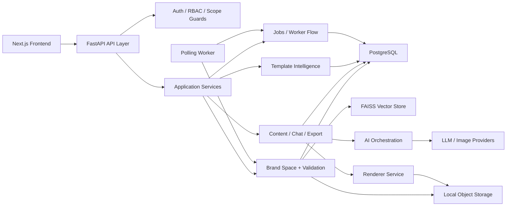
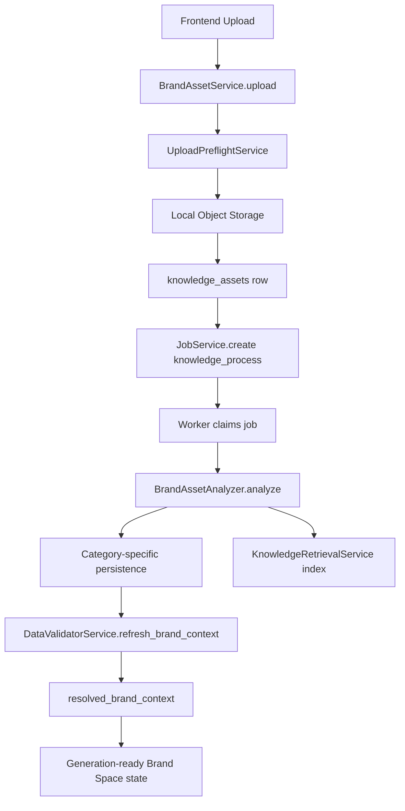
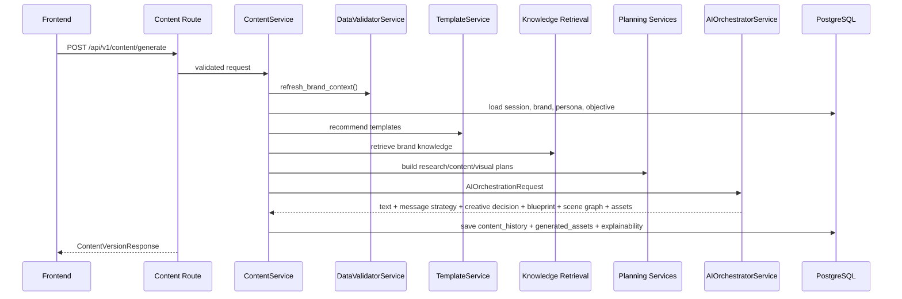
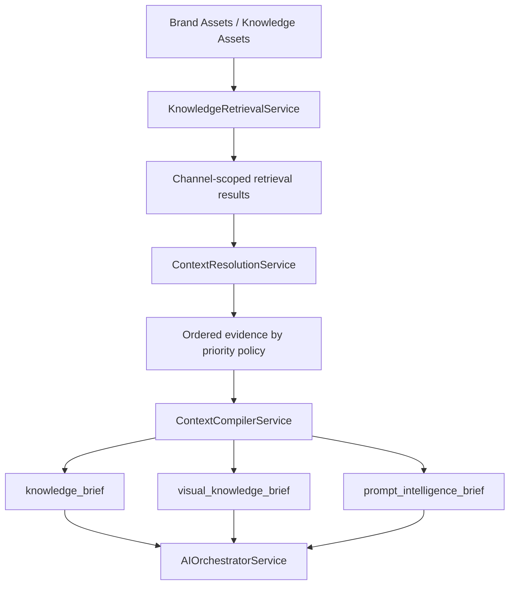
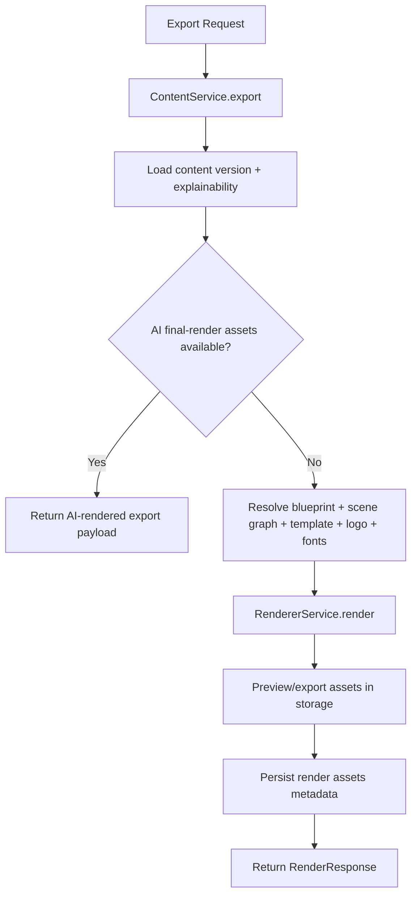
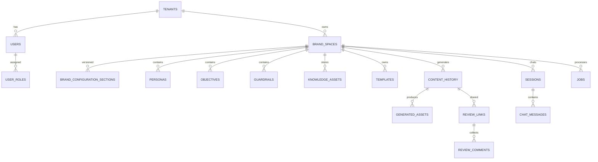

# Updated Project Architecture

## Purpose

This document describes the implemented architecture of the Violyt / BrandLoveStudio.AI project as it exists in the current codebase. It is based on the actual runtime paths, service boundaries, persistence model, and frontend integration points in the repository.

It is not a target-state vision document. It is an implementation-first architecture reference intended to help engineering, onboarding, debugging, and future documentation work.

## Relationship To Older Architecture Docs

This file supersedes and consolidates the repository viewpoints previously spread across:

- `docs/CURRENT_ARCHITECTURE_STATE.md`
- `docs/CREATIVE_GENERATION_ARCHITECTURE.md`
- `docs/RAG_GROUNDING_STRATEGY.md`

Those documents are still useful because each one captures a specific architectural slice:

- `CURRENT_ARCHITECTURE_STATE.md` describes the main backend flow from Brand Space setup through rendering
- `CREATIVE_GENERATION_ARCHITECTURE.md` focuses on AI-led creative generation, logo preservation, and export behavior
- `RAG_GROUNDING_STRATEGY.md` focuses on retrieval, grounding policy, and context assembly

The current codebase has evolved beyond treating those as mostly separate concerns. The runtime now connects them more tightly through shared planning objects, persisted explainability state, and render-authority-aware export behavior. This document reflects that integrated architecture.

## What Changed Since The Older Architecture Docs

Compared with the older architecture writeups, the current codebase now makes the following changes more explicit in implementation:

### 1. Planning is now a first-class runtime stage

Older docs emphasized retrieval, template choice, AI generation, and rendering. The current code adds a clearer planning layer before orchestration:

- `app/services/research_editorial_planning.py`
- `app/services/content_planning.py`
- `app/services/visual_planning.py`
- `app/services/format_family_planning.py`
- `app/services/content_format_guide.py`

This means generation is no longer driven mainly by:

`validated context + retrieval + prompt`

It is now driven more accurately by:

`validated context + retrieval + session lineage + planning contracts + prompt`

The planning layer decides:

- research-editorial activation
- format-family behavior such as static vs carousel vs infographic
- preferred slide counts
- content progression rules
- render mode expectations such as AI final render vs structured fallback

### 2. AI final-render authority is now a real architectural branch

`CURRENT_ARCHITECTURE_STATE.md` leaned more heavily on backend rendering as the final composition step.

The current codebase now has a more explicit split between:

- deterministic backend rendering in `app/services/renderer.py`
- AI-owned final render assets handled in `app/services/content.py` and `app/ai/orchestrator.py`

That means export no longer always means:

`blueprint -> backend renderer -> final asset`

For many visual formats, export can now mean:

`AI final render asset -> exact logo / export packaging / conversion -> final asset`

This is a major shift in the actual runtime architecture.

### 3. Explainability is now a reusable runtime dependency

The older docs correctly described explainability, but the current code uses it much more operationally.

Persisted explainability in `content_history.explainability_metadata` now feeds:

- export decisions
- selective regeneration
- rewrite lineage
- scene-graph reuse
- logo selection fallback
- artifact state continuity
- render-authority checks

This is no longer just trace metadata for debugging. It is part of the application state model.

### 4. Retrieval and grounding are more explicitly separated

`RAG_GROUNDING_STRATEGY.md` already described this direction, and the current codebase confirms it clearly.

The architecture now more strongly distinguishes:

- retrieval as channel-scoped evidence gathering
- context resolution as policy-based evidence ordering
- compiled context as normalized generation input
- visual grounding as a gated subset of evidence for image and scene generation

In practice this means:

- raw vector hits are not passed directly to generation
- `ContextResolutionService` and `ContextCompilerService` mediate evidence use
- visual grounding is stricter than generic text grounding
- retrieved evidence can be suppressed, downgraded, or marked fallback-only before model generation

### 5. Brand asset ingestion is now more than OCR plus normalization

The older architecture docs described OCR, categorization, and normalized tables well. The current codebase adds stronger runtime importance for:

- reusable brand-asset extraction
- asset review classes and trust levels
- derived decorative and icon assets
- richer template intelligence from analyzed references
- logo candidate ranking and variant selection
- typography asset resolution into render-time font paths

This makes asset ingestion a creative-infrastructure pipeline, not just a content-extraction pipeline.

### 6. Logo handling is now a deeper cross-layer capability

`CREATIVE_GENERATION_ARCHITECTURE.md` focused heavily on exact-logo preservation. The current codebase keeps that, but the behavior is now spread across more runtime layers:

- validated brand context assembly
- logo candidate collection and ranking
- AI prompt safe-zone planning
- export-time overlay logic
- scene-graph and AI-final-render fallback decisions

Logo handling is therefore no longer just an export detail. It is part of generation planning, rendering policy, and persisted explainability.

### 7. Session memory and lineage now shape generation more deeply

The older docs discussed session-aware generation. The current codebase strengthens that through:

- request lineage payloads
- prompt lineage payloads
- inheritance-policy logic
- rewrite-source tracking
- selective carousel regeneration
- parent content version linking

This means follow-up generation is now more explicitly modeled as:

- new content
- modify previous
- variant of previous
- selective regeneration of prior visual structures

### 8. Chat is more than a thin wrapper around content generation

Earlier architecture descriptions mentioned chat workspace, but the current code makes the chat layer more architecturally distinct through:

- `IntentRouterService`
- `MixedWorkflowService`
- evaluation-aware review-then-generate paths
- conversation-only modes
- text-only and visual-generation branching

So the chat system is now its own orchestration surface, not just a message log attached to content generation.

### 9. Frontend integration matters more than the old docs suggested

The older backend-focused docs did not emphasize the frontend architecture very much. The current repo shape makes it clear that the frontend is now a meaningful part of the system architecture:

- typed endpoint registry
- request wrapper and auth-aware API client
- React Query workflow hooks
- authenticated app shell and review flows
- tenant, Brand Space, analytics, and user-management screens

This does not change backend runtime logic, but it does change the practical architecture of the product.

### 10. The current architecture is more integrated than the older documents imply

The older docs describe accurate slices of the system, but each slice has become more connected in code:

- Brand validation feeds retrieval and runtime rendering decisions
- retrieval feeds planning, not only prompts
- planning feeds orchestration, not only formatting hints
- explainability feeds export and rewrite, not only logs
- AI final render and deterministic renderer coexist as deliberate branches
- chat, content, and export all reuse the same stored generation state

## Legacy Comparison Matrix

The table below summarizes the most important differences between the older architecture documents and the current implementation.

| Area | Older architecture docs emphasized | Current codebase now does | Why it matters |
|---|---|---|---|
| Core generation driver | Validated context + retrieval + prompt | Validated context + retrieval + session lineage + planning bundles + prompt | Generation is now more pre-structured before model calls |
| Planning layer | Present only implicitly through formatting and layout hints | Uses dedicated planning services for research-editorial, format-family, content-plan, and visual-plan | Planning is now a first-class architectural stage |
| Rendering model | Backend rendering looked like the universal final composition path | Render authority now branches between deterministic backend render and AI final-render passthrough | Export behavior depends on format and render authority |
| Retrieval architecture | Strong channel-aware RAG with grounding policy | Still channel-aware, but now more clearly separated into retrieval, resolution, compiled context, and visual grounding | Better control over what evidence is truly authoritative |
| Explainability | Primarily described as diagnostics and traceability | Reused operationally by export, rewrite, selective regeneration, and lineage handling | Explainability is now part of runtime state |
| Logo handling | Exact-logo preservation mostly described around generation/export | Logo selection, safe zones, overlay fallback, and render-policy behavior now span context, orchestration, and export | Logo logic is now cross-layer, not only export-time |
| Chat architecture | Chat workspace existed mainly as a session surface around generation | Chat now has intent routing, mixed workflows, evaluation flows, and text-vs-visual branching | Chat is now its own orchestration surface |
| Session continuity | Session memory supported follow-up prompts | Request lineage, prompt lineage, inheritance policies, and parent-content linking now shape generation and rewrite more deeply | Follow-ups are modeled more explicitly and safely |
| Asset ingestion | OCR, routing, normalization, and validation | Adds reusable asset extraction, trust/review classes, richer template intelligence, and render-time font/logo resolution | Ingestion now feeds creative runtime directly, not only storage |
| Frontend role | Mentioned lightly in older backend-focused docs | Typed endpoint registry, React Query hooks, auth-aware client, and app-router shells now form a clear integration layer | The frontend is now a meaningful architectural participant |

## What The System Is

Violyt is a multi-tenant SaaS platform for brand-aware content and creative generation. The system combines:

- a FastAPI backend
- PostgreSQL with SQLAlchemy async models and repositories
- a Brand Space setup and validation workflow
- asset ingestion, OCR, categorization, and retrieval
- an AI orchestration layer that produces structured content and creative decisions
- a rendering layer that either composes deterministic visuals in backend or passes through AI final-render assets
- a Next.js frontend workspace that consumes the backend through typed API contracts

## High-Level System View

## Primary Architectural Idea

The backbone of the system is not raw uploaded files and not direct model prompting.

The backbone is:

`Brand Space setup -> normalized brand intelligence -> validated resolved_brand_context -> generation planning -> AI orchestration -> persisted content version -> export / rewrite / chat continuity`

That makes `resolved_brand_context` the core shared contract between brand setup, retrieval, generation, and rendering.

Compared with the older architecture documents, two additional contracts now stand out as equally important:

- planning contracts such as research-editorial, format-family, content-plan, and visual-plan payloads
- persisted explainability state used later by export, rewrite, and selective regeneration

## Runtime Layers

## 1. Frontend Layer

Primary location:

- `frontend/app`
- `frontend/components`
- `frontend/hooks`
- `frontend/lib/api`
- `contracts/frontend-api.ts`

Responsibilities:

- present Brand Space, tenant, analytics, chat, review, and user-management flows
- manage auth token usage in browser
- call backend endpoints through a typed endpoint map and React Query hooks
- organize the application into auth routes, review routes, and authenticated main-content routes

Key frontend patterns:

- app-router layout shell in `frontend/app/layout.tsx`
- authenticated content shell in `frontend/app/(mainContent)/layout.tsx`
- axios client in `frontend/lib/api/client.ts`
- request helper in `frontend/lib/api/request.ts`
- endpoint registry in `frontend/lib/api/endpoints.ts`
- content and chat workflow hooks in `frontend/hooks/useContentWorkspace.ts`

## 2. API Layer

Primary location:

- `main.py`
- `app/api/router.py`
- `app/api/routes/*.py`

Responsibilities:

- expose REST endpoints under `/api/v1`
- validate inputs with Pydantic schemas
- inject auth principal and DB session
- enforce tenant and Brand Space scope
- delegate business logic to services
- translate domain exceptions into HTTP responses

The API layer is intentionally thin. Most business rules live in services.

## 3. Auth and Access Layer

Primary location:

- `app/core/dependencies.py`
- `app/core/security.py`
- `app/services/auth.py`
- `app/services/tenant.py`

Responsibilities:

- bearer token creation and validation
- current principal resolution
- tenant-level and Brand Space-level scope checks
- role enforcement
- activation and password reset flows
- two-factor authentication state and verification

Important access behavior:

- `super_admin` can operate at platform level
- `tenant_admin` can manage tenant resources
- `brand_user` is restricted to assigned Brand Spaces
- `super_admin` is explicitly blocked from Brand Space content flows
- Brand Space access is often enforced through the `X-Brand-Space-Id` header

## 4. Domain Service Layer

Primary location:

- `app/services/*.py`

Responsibilities:

- own application behavior and business rules
- coordinate repositories, validation, AI orchestration, storage, retrieval, and usage limits
- keep route handlers thin

Most important service groups:

- `BrandSpaceService` in `app/services/brand.py`
- `BrandAssetService` in `app/services/brand_assets.py`
- `DataValidatorService` in `app/services/data_validation.py`
- `TemplateService` in `app/services/template.py`
- `ContentService` in `app/services/content.py`
- `ChatService` in `app/services/chat.py`
- `RendererService` in `app/services/renderer.py`
- `KnowledgeService` in `app/services/knowledge.py`
- `JobService` in `app/services/jobs.py`
- `TenantService` in `app/services/tenant.py`

## 5. AI Orchestration Layer

Primary location:

- `app/ai/orchestrator.py`
- `app/ai/context_compiler.py`
- `app/ai/prompt_intelligence.py`
- `app/ai/layout_decision.py`
- `app/ai/blueprint.py`
- `app/ai/session_memory.py`
- `app/ai/brand_asset_analysis.py`
- `app/ai/providers/*`

Responsibilities:

- compile a structured generation context from brand, persona, objective, retrieval, research, and session lineage
- determine layout and asset strategies
- generate structured content payloads
- produce blueprint and scene graph outputs
- optionally generate or edit visual assets
- validate and repair output when needed
- return explainability and artifact metadata used later by export and rewrite flows

Architecturally, this layer is not the same thing as rendering. It makes creative decisions and produces structured outputs. Rendering happens afterward.

## 6. Rendering Layer

Primary location:

- `app/services/renderer.py`

Responsibilities:

- convert text, blueprint, scene graph, template metadata, logo assets, and image assets into final preview and export files
- support static, carousel, infographic, PDF, and DOC export paths
- handle deterministic layout, text fitting, overlap checks, visual quality assessment, and font resolution
- preserve brand palette and logo placement rules

The rendering layer has two modes:

- deterministic backend rendering
- passthrough of AI final-render assets when the format requires AI-owned visual output

## 7. Persistence and Integration Layer

Primary location:

- `app/models/*`
- `app/repositories/*`
- `app/db/*`
- `app/integrations/object_storage.py`
- `app/integrations/vector_store.py`

Responsibilities:

- store transactional entities in PostgreSQL
- provide typed repository access for scoped queries
- persist uploaded and generated files into local object storage
- persist retrieval chunks in FAISS namespaces

## Main Functional Domains

## Tenant and User Management

Primary code:

- `app/services/tenant.py`
- `app/models/tenant.py`

Responsibilities:

- tenant creation
- tenant admin bootstrapping
- usage limit assignment
- user creation, update, deactivation
- tenant logo storage
- tenant analytics summaries

Core tables:

- `tenants`
- `users`
- `roles`
- `permissions`
- `user_roles`
- `activation_tokens`
- `usage_limits`
- `usage_consumption`

## Brand Space Lifecycle

Primary code:

- `app/services/brand.py`
- `app/models/brand.py`

Responsibilities:

- Brand Space creation in draft state
- section-wise brand configuration storage
- persona, objective, and guardrail persistence
- publish / unpublish / archive / restore lifecycle transitions
- refresh of validated brand context

Core tables:

- `brand_spaces`
- `brand_configuration_sections`
- `personas`
- `guardrails`
- `objectives`
- `brand_space_members`

Important pattern:

The system stores Brand Space setup as section payloads and then compiles them into a canonical `resolved_brand_context`.

## Brand Asset Intelligence and Validation

Primary code:

- `app/services/brand_assets.py`
- `app/services/data_validation.py`
- `app/ai/brand_asset_analysis.py`

Responsibilities:

- accept Brand Space attachments by field
- validate upload size and shape before expensive work
- analyze OCR and visual signals
- route assets into typed categories
- extract normalized structured data
- derive reusable brand assets
- index searchable text into the vector store
- write validation status and conflicts
- refresh the brand's validated context snapshot

Core tables:

- `knowledge_assets`
- `brand_logo_assets`
- `brand_logo_metadata`
- `audience_insight_assets`
- `audience_insight_structured_data`
- `visual_reference_assets`
- `mood_board_assets`
- `reusable_brand_assets`
- `color_palette_entries`
- `typography_guides`
- `word_bank_uploads`
- `positive_words`
- `negative_words`
- `replaceable_words`
- `asset_processing_status`
- `asset_validation_results`
- `asset_category_routing`
- `data_conflicts`
- `resolved_brand_context_snapshots`

## Template Intelligence

Primary code:

- `app/services/template.py`
- `app/models/knowledge.py`

Responsibilities:

- upload reusable templates
- analyze editable zones and layout patterns
- capture platform and export rules
- score templates against prompt, brand context, and studio panel
- produce ranked template recommendations and adaptation plans

Core tables:

- `templates`
- `template_metadata`

Important behavior:

Template recommendation is not just based on template tags. It considers prompt signals, platform fit, visual rules, export support, and brand compatibility.

## Content Generation and Rewrite

Primary code:

- `app/services/content.py`
- `app/ai/orchestrator.py`

Responsibilities:

- load runtime brand context
- gather session memory and lineage
- resolve persona, objective, and template selection
- retrieve brand-scoped knowledge
- invoke planning services
- call the AI orchestrator
- persist content version history and generated assets
- handle rewrite, export, and selective regeneration

Core tables:

- `sessions`
- `chat_messages`
- `content_history`
- `generated_assets`

Important observation:

`ContentService` is effectively the application orchestrator above the model-facing AI orchestrator. It binds together brand validation, template intelligence, retrieval, research, usage limits, AI generation, and export decisions.

## Chat Workspace

Primary code:

- `app/services/chat.py`
- `app/services/intent_router.py`
- `app/services/mixed_workflow.py`
- `app/services/conversation.py`

Responsibilities:

- create and list chat sessions
- record user and assistant messages
- route prompts into content generation, rewrite, strategy chat, evaluation, or small talk
- attach content versions back to assistant messages
- preserve conversational context for follow-up generation

## Review and Collaboration

Primary code:

- `app/services/review.py`
- `app/models/collaboration.py`

Responsibilities:

- create shareable review links
- support external comments
- allow tokenized review access outside the standard tenant auth flow
- track approval status and change requests

Core tables:

- `review_links`
- `review_comments`

## Social and Analytics

Primary code:

- `app/services/social.py`
- `app/services/analytics.py`
- `app/models/collaboration.py`

Responsibilities:

- persist social connection records
- store encrypted social tokens
- provide tenant, brand, and platform analytics summaries
- support usage visibility and platform oversight

Core tables:

- `social_connections`
- `analytics`

## End-To-End Brand Asset Ingestion Flow

## End-To-End Generation Flow

Compared with `CURRENT_ARCHITECTURE_STATE.md`, this flow now needs the planning stage and the persisted explainability stage to be considered part of the core generation architecture rather than supporting details.

## Retrieval and Grounding Architecture

The older `RAG_GROUNDING_STRATEGY.md` remains directionally correct, but the current codebase makes the runtime separation clearer.

The system now treats these as different architectural concerns:

- retrieval
- context resolution
- compiled context construction
- visual grounding
- orchestration

Important current behavior relative to the older docs:

- retrieval is still channel-aware and tenant/brand scoped
- the orchestrator does not consume raw search output directly
- visual grounding is stricter than general knowledge grounding
- lower-priority channels such as metadata or template cues can influence structure without automatically becoming authoritative visual truth

## Creative Generation Changes Relative To The Older Creative Doc

`CREATIVE_GENERATION_ARCHITECTURE.md` correctly described the AI-led creative direction. The current codebase keeps that direction, but the implementation now adds more explicit runtime branching and persistence:

- `render_authority` is now persisted and enforced
- AI final-render assets can short-circuit export
- deterministic renderer remains a supported fallback or structured-composition path
- exact-logo handling participates in prompt planning, candidate resolution, export overlay, and rewrite/export reuse
- selective regeneration logic can reuse prior final-render assets when only part of a sequence needs to change

So the creative architecture has moved from:

`AI-led generation with deterministic finishing`

to a more precise model:

`AI-led generation with explicit render authority, persisted generation state, and format-aware export branching`

## End-To-End Export Flow

## Planning Layer

A distinct planning layer now sits between retrieval and AI generation.

Primary code:

- `app/services/research_editorial_planning.py`
- `app/services/content_planning.py`
- `app/services/visual_planning.py`
- `app/services/format_family_planning.py`
- `app/services/content_format_guide.py`

Responsibilities:

- translate prompt and research context into a planning contract
- decide format-family behavior such as static vs carousel vs infographic
- shape content progression before model generation
- activate research-editorial structure when the prompt is analytical or evidence-driven

This is important architecturally because the AI layer is not operating on raw prompt alone. It is receiving a curated, preplanned generation brief.

## AI Orchestrator Internals

The AI orchestrator currently performs several distinct jobs:

- guardrail validation before generation
- context resolution and priority ordering
- compiled-context construction from brand, persona, objective, retrieval, session, template, research, and planning data
- message-strategy generation
- creative decision generation
- structured copy generation
- scene graph generation and repair
- optional image generation and image edit passes
- semantic validation and fallback repair

The orchestrator returns:

- `StructuredTextPayload`
- `MessageStrategyPayload`
- `CreativeDecisionPayload`
- `BlueprintPayload`
- `GenerationSceneGraph`
- `GeneratedImageAsset` entries
- tone analysis
- explainability metadata
- render authority information

## Rendering Strategy

The renderer is deterministic, but the platform supports two rendering authorities:

### Backend render authority

Used when the system can safely assemble the final artifact from:

- blueprint zones
- text payload
- template metadata
- selected logo asset
- uploaded fonts
- generated or reference image assets

### AI render authority

Used when the format requires an AI-generated final surface, especially for richer visual deliverables. In these cases the backend stores and exports AI final-render assets rather than reconstructing the canvas entirely from zones.

This split is one of the most important current design decisions in the codebase.

It is also one of the biggest practical changes relative to the older architecture descriptions, which leaned more heavily on backend rendering as the universal final-composition step.

## Data Model Overview

## Storage Model

### PostgreSQL

Stores:

- multi-tenant identity and RBAC
- Brand Space section payloads
- normalized brand intelligence
- validation snapshots and conflicts
- template records and metadata
- content sessions, messages, content history, and generated asset metadata
- jobs, usage, review links, comments, and social connections

### Local Object Storage

Implemented in `app/integrations/object_storage.py`.

Stores:

- uploaded brand and knowledge files
- derived reusable brand assets
- template source files
- generated previews and exports

Storage paths are tenant- and brand-scoped.

### FAISS Vector Store

Implemented in `app/integrations/vector_store.py` and accessed through `app/ai/rag/retrieval.py`.

Stores:

- brand-scoped searchable text chunks
- channel-separated retrieval namespaces
- OCR and normalized retrieval documents

Fallback behavior:

If an OpenAI embedding key is unavailable, the vector layer falls back to a deterministic hash embedding implementation instead of failing completely.

## Background Job Model

Primary code:

- `app/services/jobs.py`
- `app/workers/runner.py`
- `app/models/collaboration.py`

The current worker architecture is polling-based.

Lifecycle:

- create `jobs` record
- worker claims available job using lease ownership
- worker sends heartbeat during execution
- service marks succeeded, retries, or failed status

Current job types:

- `knowledge_process`
- `template_analysis`
- `brand_context_refresh`
- `render_preview`
- `render_export`
- `social_publish`

The architecture is queue-friendly even though the current implementation is a polling worker.

## Multi-Tenant Isolation Model

Tenant and brand isolation is implemented across:

- auth principal resolution
- route dependencies
- repository scoped queries
- tenant and brand foreign keys on models
- Brand Space membership checks

Common scope fields:

- `tenant_id`
- `brand_space_id`

Access is enforced both in route dependencies and repository/service behavior.

## Explainability and Artifact State

Generated content persists much more than plain copy.

The system also stores:

- selected persona and objective
- planning hints and layout decisions
- message strategy
- scene graph
- validation report
- live research results
- session memory and lineage
- logo candidates and logo selection
- final-render asset references
- generation trace id
- artifact state and revision lineage

This matters because export, rewrite, chat continuity, and selective regeneration all depend on persisted explainability metadata rather than recomputing everything from scratch.

## Frontend-to-Backend Integration Model

The frontend integration style is straightforward and strongly typed:

- endpoint definitions live in `frontend/lib/api/endpoints.ts`
- shared request/response shapes exist in `contracts/frontend-api.ts`
- requests are executed through `frontend/lib/api/request.ts`
- bearer auth is injected by `frontend/lib/api/client.ts`
- domain-specific React Query hooks sit in `frontend/hooks/*`

The frontend primarily operates as:

- an authenticated app shell for tenants, brand spaces, analytics, and user management
- a workflow shell for content generation, chat, review, and export

## Current Architectural Strengths

- clear service-oriented backend boundaries
- strong domain modeling for Brand Space and content history
- validated canonical brand context before generation
- robust asset ingestion and normalization flow
- explicit retrieval, grounding, and planning separation
- explainability-first content persistence
- support for both deterministic rendering and AI final-render delivery
- typed frontend-to-backend integration
- broad test coverage around orchestration, rendering, context compilation, and content generation

## Current Architectural Tradeoffs

- `app/services/content.py` and `app/ai/orchestrator.py` are very powerful but also very large, so they act as integration hubs and concentrate complexity
- the planning, orchestration, export, and explainability flows are now tightly connected, which improves capability but increases cognitive load
- object storage is local-first rather than cloud-native
- background processing is polling-based rather than broker-based
- some template and visual fidelity behavior is still heuristic
- the AI and rendering split is intentional, but it means export behavior can differ by format and render authority

## Most Important Architectural Takeaways

1. The system is centered on validated brand context, not direct prompt-only generation.
2. `ContentService` is the top-level application orchestrator for creative generation.
3. Retrieval, grounding, planning, orchestration, and rendering are now distinct runtime stages.
4. The AI orchestrator is a planning-aware structured-output engine, not the renderer itself.
5. The renderer supports both deterministic composition and AI final-render passthrough.
6. Explainability metadata is a first-class runtime dependency, not just debug output.
7. Brand asset processing is a normalization pipeline, not only a file upload pipeline.
8. The planning layer has become a meaningful architectural stage between retrieval and generation.
9. The newer architecture is best understood as an integration of the old "current state," "creative generation," and "RAG grounding" documents rather than a replacement of only one of them.

## Suggested Reading Order In The Codebase

For future contributors, the fastest way to understand the architecture is:

1. `main.py`
2. `app/api/router.py`
3. `app/services/brand.py`
4. `app/services/data_validation.py`
5. `app/services/brand_assets.py`
6. `app/services/template.py`
7. `app/services/content.py`
8. `app/ai/orchestrator.py`
9. `app/services/renderer.py`
10. `frontend/lib/api/endpoints.ts`
11. `frontend/hooks/useContentWorkspace.ts`

## Implementation Notes

This architecture document reflects the current implementation state of the project at the time it was written. If the generation, rendering, retrieval, or validation paths change, this document should be updated alongside the code rather than treated as a static product-level spec.
